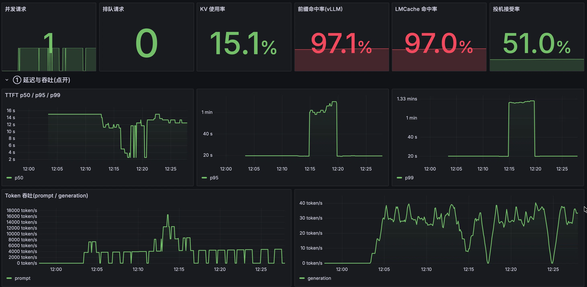

# vllm-xtu-moe

> ⚠️ **命名变更(2026-10-07,用户定案)**:本文件里出现的旧环境变量名**已修改为**下面的规范名 ——
> `XIAOTU_MOE_W4A8` **已修改为** `XIAOTU_MOE_INT8`(int8 激活路径**总开关**,默认由权重格式决定);
> `XIAOTU_MOE_INT8_ALIGN` **已修改为** `XIAOTU_MOE_INT8_ALIGN`(实现选择:ALIGN tile,默认档);
> `XIAOTU_MOE_INT8_VNNI` **已修改为** `XIAOTU_MOE_INT8_VNNI`(实现选择:旧 VNNI tile,默认 0);
> `XIAOTU_MOE_I8_MIN_M` **已修改为** `XIAOTU_MOE_INT8_VNNI_MIN_TOKENS`(⭐ M 阈值,**默认 160**,唯一设定处)。
> 旧名仍被识别:会**告警一次**并映射到新名(**仍按旧值生效**),绝不静默退回 fp32 ✓


> **XTU = X Transformers Unity**(读音:汉语「小兔」)—— 一个**高性能 MoE 推理加速层**。
>
> 这是一个面向**超大 MoE 模型**的 **vLLM 插件**,核心思路是把计算拆开:
>
> * **GPU** 负责注意力、KV cache、embedding 等**非专家部分**;
> * **CPU** 负责**专家权重**与**专家计算**;
> * 对**长 prompt**,还会把**一部分专家计算流式搬到 GPU**。
>
> 也就是说:在**"显存放不下专家权重"**的情况下,仍然让大 MoE 模型跑起来,
> 而且**尽量不改主线 vLLM**。
>
> **项目重点**
>
> * **DeepSeek / GLM / MiMo** 这类**超大 MoE**
> * **CPU + GPU 混合推理** · **低显存需求**
> * **高性能长上下文推理**
> * **兼容主线 vLLM,不需要 fork**
> * 主要面向**大模型部署与工程优化**

[**English**](README_EN.md) · 中文(默认)

> **📌 当前版本：v0.2.6**（2026-10-06）—— **自举开发：全程用自己开发的引擎作推理后端，打通 FP4 专家权重的 INT8 激活计算路径**：
> **为 MXFP4 专家权重增加 INT8 激活的计算路径**（fp4 码值 `{0, ±1…±12}` 完全含于 int8 ⇒ **权重侧零代价**，全部数值代价只来自激活量化）—— 内核级 **24.9 → 15.1–15.7 ms/层（1.54–1.62×）**，`max_abs ≈ 3.163e-03`；
> 端到端（qfn · MXFP4-FP8）：GSM8K 全量 200 题 **base 193/200 · int8 193/200**、逐题一致 **194/200（净变化 0）**，256K 四针 **两臂 4/4 + `finish_reason=stop`**，Vision 23 逐项一致 18/23；
> 同时修复**回退路径回归**（原本慢 16–22% ⇒ **+1.49% 指令**）、打通 **qfn 的 MTP**（解码 **2.44×**）、qfn 服务默认线程数改为 **120（= 5 核/CCD）**；该路径**默认关**，`XIAOTU_MOE_INT8=1` 启用。
> 发行说明：[`RELEASE_NOTES_v0.2.6.md`](RELEASE_NOTES_v0.2.6.md)

---

> [!WARNING]
> ⚠️ **关掉它的代价（必须一起知道）**：LMCache 的原始价值是
> **让服务重启变得可接受**（跨重启复用前缀）✓。
> 关掉后每次重启都要**全量重预填**：实测一个长会话的开发 agent
> 重新 prefill 了 **21 分钟**才能开始工作（原来的 10K 前缀对比：冷 26.7 s
> ⇒ 重启后 1.27 s）✗。⇒ 所以“关 LMCache”与“不能重启”是一对互相强化的约束 ✓
>

> ## ⚠️ 请勿开启 LMCache(已知恶性问题)
>
> **本项目已默认关闭 LMCache**(`LMCACHE=0`,且不启动 `lmcache_server`)。原因:
>
> * 🔴 **长 prompt 会让整个引擎崩掉**:一次大请求即可触发
>   `KV connector reported block-level load failures (invalid_block_ids)` ⇒ `EngineDeadError`
>   ⇒ **所有会话一起断**(我们实测:同一 78 万 token 请求,开 LMCache 两次都崩;
>   关掉后 20 万 token 请求 200 通过、GPU 预填从 0 次恢复到 686 次)。
> * 🔴 **与输出退化(重复、意图漂移、写错路径)高度相关**,且与上游多条未修完的 issue 吻合。
> * ✅ **关掉还有额外收益**:GPU 省 **0.85 GiB**、宿主省 **~65 GiB** RSS,且 **GPU 预填恢复工作**。
>
> **完整证据、上游 issue 清单、关闭/回滚方法见
> [`docs/KNOWN_ISSUES_LMCACHE.md`](docs/KNOWN_ISSUES_LMCACHE.md)。**
> **在上游修复前,请勿在生产启用** —— 下文凡提到 LMCache 的段落均**仅作历史记录**。

## 项目特色

1. 任意 MoE 模型:不绑死某一代架构。已跑通 DeepSeek-V4 / V4.1 系列、
   GLM-5.3-Flash(含 A100 / SM80 的注意力后端)与 MiMo-V2.5。
   **MiMo-V2.6-Flash-RL 也已在 A100/SM80 上跑通**:骨架 / 1M 上下文 / 真权重长文本端到端均已实测通过
   **多模态**——图片 ✅（渲染 `ZQ7K42` 读对）、视频 ✅（红方块「出现又消失」，连**时序**都对）、**音频 ✅**（3 声提示音被正确描述为 "three short, high-pitched electronic beeps"）、**组合**（图 + 5,444 token 长文本 + MTP k=1）✅；音频需**启动前**装好 `vllm[audio]`+`av`+`torchaudio`（见 `MODEL_GUIDES` §0.1c），且**数字计数类探针在合成音上不可靠**（域限制）。它走的是与 V4.1 相同的 **MXFP4** 引擎路径，体积 161 GiB ——
   见 `docs/MODEL_GUIDES.md` §3b 与 `docs/EXPERIMENTS.md` B92–B133。
2. 任意 x86 指令集:`scalar → AVX2 → AVX-512(base/VNNI/BF16/VBMI)`,
   运行时按 `/proc/cpuinfo` 自动选最高可用变体。
3. 显存优先级固定不变:`KV 池 → GPU 预填充 staging → 投机解码 draft → 激活工作区(∝ MBT)`;
   任何新功能都不得把这条顺序往后挤。
   > 2026-09-20 修订:①去掉"专家层常驻" —— 实测效果很差(每层 3.36 GiB,
   > 换来的收益抵不上它对 32K 预填充的挤压,用户裁定不再列为优先级);
   > ②补上"激活工作区" —— 它正比于 chunk(=MBT),是之前连续两次长 prompt OOM 的真凶,
   > 却一直没被列进优先级。
4. 单服务器多 NUMA 节点也只占用一份内存:每个 NUMA 节点只存取本地内存,
   在最大化性能的同时节省了内存占用。

---
## 实测平台

下文所有性能数字都在这台机器上取得:

| 项 | 配置 |
|---|---|
| CPU | 2× AMD EPYC 9654(192 物理核 / 384 线程,8 NUMA node) |
| 内存 | 1538 GiB DDR5 |
| GPU | 3× NVIDIA A100-PCIE-40GB |
| 系统 | Ubuntu 22.04 · conda env `lvllm` |

---

## 性能

* 口径：**聚合吞吐**——`prefill (tok/s) = 并发数 × prompt_tokens / TTFT`、`decode (tok/s) = 并发数 × 1000 / median(ITL)`
  > `decode` 取 **median ITL**(相邻 token 间隔中位数)而不是 median TPOT:`median TPOT` 是**每请求平均**,会把**同一 step 里混进来的 prefill 工作**算进解码时间,导致长上下文 C=2 时被严重低估(实测同一批数据:median TPOT 口径下 MiMo 长 C=2 = 9.8,而 median ITL 口径 = **39.6**,真实争用只有 **1.36×**;GLM 更极端:2.9 vs **29.6**)。详见 `docs/EXPERIMENTS.md` B126。
  （C=1 时即单流速率；等价于「该阶段的总 token 数 ÷ 该阶段墙钟」）。均由同一次 `vllm bench serve` 换算；
  `decode` 取 **median ITL**（`mean` 会被极少数离群步拉高,`median TPOT` 会被混入的 prefill 拉低）。
  > ℹ️ **decode 与 C 的关系**:真实解码争用很小(倍率 **1.13–1.77×**,按 median ITL);早期表里曾出现「长 C=2 的 decode 明显低于 C=1」,那是 **median TPOT 被混入的 prefill 步污染**所致,另一部分来自把 `--max-num-seqs` 设成 1 导致 C=2 退化为串行。两者均已修正,判据见 `docs/EXPERIMENTS.md` **B124/B126**。
* 数据集：**random 随机 token**，`--random-input-len` 固定为短 128 / 长 16384，输出 128；前缀缓存开；每格 8 个请求、**每格不同 seed**。
* 表中「实际 token」= `total_input_tokens / completed`（含 chat template 的少量开销）。
  配置细节、判据与 `MBT` 取舍见 `docs/TUNING_GUIDE.md` §8 与 `docs/EXPERIMENTS.md`。

| 模型(最优配置) | prompt | 实际 token | 并发 | prefill (tok/s) | decode (tok/s) |
|---|---|---|---|---|---|
| **GLM-5.3-Flash**<br>TP=2 · util 0.85 · **MAXLEN 262144**<br>MBT 12288 · MTP 关 | 短 | 140 | 1 | **115.2** | **22.0** |
| | 短 | 140 | 2 | **140.8** | **27.8** |
| | 长 | 16,396 | 1 | **266.3** | **21.4** |
| | 长 | 16,396 | 2 | 待测 | 待测 |
| **DeepSeek-V4.1-Flash**<br>TP=2 · util 0.85 · **MAXLEN 262144**<br>MBT 8192 · **CED 开**（长两行） · 投机解码关 | 短 | 128 | 1 | **254.3** | **19.8** |
| | 短 | 128 | 2 | **350.4** | **28.0** |
| | 长 | 16,384 | 1 | **903.9** | **19.3** |
| | 长 | 16,384 | 2 | **1204.2** | **15.4** |
| **MiMo-V2.6-Flash-RL**<br>TP=2 · util 0.85 · **MAXLEN 131072**<br>MBT 8192 · **seqs 4** · **MTP k=1** · **GPU 预填开(门槛 4096)** · 含形状预热 | 短 | 128 | 1 | **232.0** | **30.5** |
| | 短 | 128 | 2 | **367.5** | **40.7** |
| | 长 | 16,384 | 1 | **811.3** | **27.3** |
| | 长 | 16,384 | 2 | **1455.3** | **39.6** |

GLM / DeepSeek-V4.1 未开投机解码（random 数据集对投机是最坏情况，且会挤占长上下文的显存）；**MiMo-V2.6 开了 MTP k=1**。MiMo 的 prefill 数字是 **GPU 预填开启后**的口径（`VLLM_XIAOTU_GPU_PREFILL_MIN_TOKENS=4096`；该变量不设或为 0 表示**关闭**，会让 prefill 掉到 ~310，见 `docs/MODEL_GUIDES.md` §0.1）。
> ⚠️ **口径提醒(2026-10-04 更正)**:上表"长 C=2 的 decode **9.8**"用的是 **median TPOT**,它把**预填步**也算进分母 ⇒ 只要混进几个 chunk 就被严重污染 ✗;**干净口径应看 median ITL**,真实解码争用只有 **1.13–1.77×**(判据 **B126**)。同族的 MiMo 203.6 ms / GLM 700.8 ms 同理作废。
> ⚠️ **单引擎混跑"长预填 + 解码"会饿死解码**(实测,**B277**/**B279**):正在解码的请求,其 **ITL 下界 = 相邻两次解码步之间排入的预填量 ÷ 预填吞吐**。实测注入一个 32768-token 的 prompt 后,该解码请求的 ITL 从 **中位 64.8 ms 暴涨到 ~8.4 s,并持续整个 57.6 s 预填窗口**(它是每步只拿到 1 个 token,而每步被一个 `MBT` 大小的预填 chunk 撑满)。
>   * 压小 chunk(`--long-prefill-token-threshold`)会**同时毁掉预填效率**(每个 chunk 都要重新流式过 40 层权重:2048-token chunk 仅 ~410 tok/s,8192 的 ~1000)⇒ **净效果更差**(解码吞吐 1.25 → 0.57 tok/s)⇒ **没有可用的调度旋钮** ✗
>   * **单流交付(本仓 8070 的口径)**:用 `--max-num-seqs 1` ⇒ 请求串行、不存在混跑 ⇒ 单流 ITL 稳定在 ~65 ms ✓
>   * **多用户并发**:应做 **prefill/decode 分离(PD disaggregation)**,而不是调 `max-num-seqs` / `max-num-batched-tokens` / `long-prefill-token-threshold` ✓
>   * **根因**:预填吞吐受 **GPU 计算**限制(A100 无原生 FP4、须解包 ⇒ 实测 **SM 利用率 94–100% 而显存控制器仅 5–48%**)⇒ 提高预填吞吐要靠 **GPU 侧 MoE 内核/量化路径**,不是调度 ✓
> ⚠️ **"`--max-num-seqs` 必须 ≥2"只对【基准口径】成立**:早期用 `seqs=1` 跑 `C=2` 会**串行**、把短 C=2 的聚合 prefill 压到 54(那是**配置问题,不是模型问题**,判据 **B124**)⇒ 做**并发基准**时 `seqs≥2`;做**单流交付**时 `seqs=1` 才是对的 ✓


## 持久化输入缓存(LMCache,SSD)

> 🔴 **【不推荐 / 已知恶性问题】本节仅作历史记录** —— 见上文警示与
> [`docs/KNOWN_ISSUES_LMCACHE.md`](docs/KNOWN_ISSUES_LMCACHE.md):
> LMCache 会导致**长 prompt 崩溃**与**输出退化**;本项目已默认 `LMCACHE=0`。
> 下列数字是**当时**测得的能力,不代表现在推荐这样部署。

服务重启后仍能复用巨大重复前缀(不再重新 prefill):

```bash
CHUNK_SIZE=256 bash scripts/serve_lmcache.sh &        # L1=内存 + L2=SSD
LMCACHE=1 PYTORCH_CUDA_ALLOC_CONF=expandable_segments:False bash scripts/serve_v41.sh
```

实测(V4.1-Flash,10K 前缀):冷 26.7 s ⇒ **重启后 1.27 s**;连 LMCache 服务端也重启仍 **1.27 s**
(⇒ 从 **L2 磁盘**命中 ✓)。三条前置条件与 V4.1 的必要补丁见 `docs/MODEL_GUIDES.md` §5 ✓。

## 性能观测:通过 DeepSeek Harness 进行本项目开发的典型性能统计

> ⭐ **本项目的开发方式是"自举(bootstrapping)"的**:agent 自身充当开发者,而**被开发的这个引擎
> 正是它的推理后端** —— 即每一次推进、每一次回归、每一轮 A/B 测量,都由**被改造的引擎自己服务**。
> 这同时验证了引擎在**真实在线负载**下的稳定性:**v0.2.6 会话期间,该服务连续运行 16 小时以上无故障** ✓
>
> agent 侧性能统计(该次会话;后端 = **DeepSeek-V4.1-Flash**,TP=2):
> **18 轮 / 718 步** · Token **232,529,485**(agent 侧缓存命中 **99.7%**)· 输出 **474,129** tok
> **模型用时 282 分 30 秒** · **工具调用用时 506 分 52 秒**(合计 ≈ 13.2 h)· TTFT **6.6 s** · **39 tok/s**



> 上图是本项目**自建监控栈**在一次典型开发会话中的读数(面板来自 vLLM + LMCache 业务指标与主机
> NUMA/GPU/CPU 指标)。该次会话中:**前缀命中率(vLLM) 97.1%**、**LMCache 命中率 97.0%**、
> **投机解码接受率 51.0%**、KV 使用率 15.1%、TTFT p50 ≈ 14 s(p99 ≈ 1.33 min,长预填阶段)。

复现这张图:见 `docs/MODEL_GUIDES.md` §5(启动监控栈与看板的完整步骤)。
图中涉及的 LMCache 修复对应上游 PR [LMCache#5268](https://github.com/LMCache/LMCache/pull/5268)(**尚未合并** ⇒ 当前需本地补丁 ✓)。

## 快速开始

```bash
# 1) 主线 vLLM(本插件是插件,不需要 fork)
pip install vllm==2.5.0

# 2) 本插件(发行名 vllm-xtu-moe,**不发 PyPI**;二选一)
# (a) 从 GitHub Release 附件装:wheel 里已含 6 个 ISA 变体,无需本地编译器
pip install ./vllm_xtu_moe-0.2.2-cp312-cp312-manylinux_2_34_x86_64.whl
# (b) 源码安装(需要本地编译器):
# CXX=g++-16 PYTHON=$(which python) bash scripts/build_engine_variants.sh && pip install -e .

# 3) 跑一个专家权重放不进显存的 MoE 模型
VLLM_EXPERTS_LOAD_DEVICE=cpu \
vllm serve <MODEL_DIR> --tensor-parallel-size 2 --enable-expert-parallel \
  --max-model-len 65536 --max-num-batched-tokens 8192 --gpu-memory-utilization 0.95
```

逐模型配方、显存核算、自检与排错 → **[`docs/RUNBOOK.md`](docs/RUNBOOK.md)**、
**[`docs/MODEL_GUIDES.md`](docs/MODEL_GUIDES.md)**。

---

## 版本变更(简)

| 版本 | 主题 |
|---|---|
| **v0.2.6** | **自举开发：INT8 激活 × FP4 专家权重 的计算路径** —— 为 **MXFP4** 专家权重增加 **INT8 激活**路径（fp4 码值全含于 int8 ⇒ **权重侧零代价**）：内核级 **24.9 → 15.1–15.7 ms/层（1.54–1.62×）**；端到端（qfn·MXFP4-FP8）GSM8K **两臂 193/200**、逐题一致 194/200（净 0）、256K 四针两臂 4/4 + `stop`、Vision 23 逐项一致 18/23；修复**回退路径回归**（慢 16–22% ⇒ +1.49% 指令）；打通 **qfn 的 MTP**（**2.44×**）；qfn 默认线程数 **120（5 核/CCD）**；路径默认关（`XIAOTU_MOE_INT8=1`）|
| **v0.2.5** | **优化 GPU prefill 内存机制** —— **为 GPU 算子增加对 NUMA 切片权重的处理路径,节省了一层权重空间**(对 DeepSeek-V4.1-Flash **节约 6.33 GiB**;2 个 GPU 时**每卡节约 3.16 GiB**):单层 staging 10.73→**7.56 GiB/rank**、离线同层 364.91→**341.31 ms**、数值逐字节相同;**支持 1M 上下文 + GPU 预填充**(CED 让每 token KV 5437→2106 B,1M 只需 KV ~2.2 GiB);**Engram pinned 浪费修复**(宿主内存 **−75 GiB**);rebase 到上游后 **CED 恢复生效**(16k prefill 527.8→**982.4** tok/s);**TP=2 一律用 GPU1+GPU2**(GPU0 只有 x8);服务日志按 **PID** 命名 |
| **v0.2.4** | **支持 MiMo-V2.6-Flash-RL + 性能优化** —— 新模型接入（MXFP4/TP=2/1M/多模态/MTP k=1，**层内数值门禁 94/94 层通过**、312K 针测试命中、多模态真图通过）；**GPU 预填充「0=关闭」陷阱修复**（长 prefill 313→**811** tok/s）；**`--max-num-seqs` 默认统一为 4**（短 C=2 prefill 236→**367**）；**decode 口径改为 median ITL**（真实争用 1.13–1.77×）；修好 MXFP4 上的层内数值门禁 |
| **v0.2.3** | **跟进上游 + GLM/MiMo 的 MTP** —— 补丁栈 rebase 到上游 `133b71e0b`(11 补丁/40 文件);**GLM-5.3-Flash 的 MTP 落地**(draft 层识别 + GPU 常驻,`SPEC_K=1..4`);**MiMo-V2.5(310B/15B)单卡端到端支持**,MTP k=1 decode +10%;显存契约重标定(GLM `GPU_UTIL` 0.85 → **0.82**) |
| **v0.2.2** | **支持 GLM-5.3-Flash** —— FP8 GPU 预填充接线(4K prompt TTFT 29.3 → 22.8 s)、256K × 2 路并发交付配置;修掉 e4m3 次正规数解码缺陷 + 新增全码字门禁 |
| **v0.2.1** | **针对引擎的显著性能优化** —— CPU MoE 引擎在全部真实形状上**反超 `lk_moe`**;DeepSeek-V4-Flash 同步受益 |
| v0.2 | DeepSeek-V4.1-Flash 全链路可用(1M 上下文 + GPU 预填充 + 投机解码)+ CPU 预填充路径优化 |
| v0.1.0 | 首个公开版:混合模式(CPU 专家 + GPU 其余)、AVX2 / AVX-512 多 ISA、DeepSeek-V4 系列 |

改动清单、性能对照与运行参数变更:
[**v0.2.6**](RELEASE_NOTES_v0.2.6.md) · [**v0.2.5**](RELEASE_NOTES_v0.2.5.md) · [**v0.2.4**](RELEASE_NOTES_v0.2.4.md) · [**v0.2.3**](RELEASE_NOTES_v0.2.3.md) · [**v0.2.2**](RELEASE_NOTES_v0.2.2.md) · [**v0.2.1**](RELEASE_NOTES_v0.2.1.md) · [**v0.2**](RELEASE_NOTES_v0.2.md) · [**v0.1.0**](RELEASE_NOTES_v0.1.0.md)
(归档:[v0.2pre](RELEASE_NOTES_v0.2pre.md))

---

## 文档

**面向使用者 —— [`docs/`](docs/)**

| 文档 | 内容 |
|---|---|
| [`docs/RUNBOOK.md`](docs/RUNBOOK.md) | **运行手册**:安装、启动参数、显存核算、GPU 预填充配方、JIT 缓存、发布流程 |
| [`docs/MODEL_GUIDES.md`](docs/MODEL_GUIDES.md) | 逐模型的资源需求、启动命令与性能 |
| [`docs/BENCHMARKS.md`](docs/BENCHMARKS.md) | 实测数据与复现方式 |
| [`docs/KNOWN_LIMITATIONS.md`](docs/KNOWN_LIMITATIONS.md) | 已知限制与不支持的组合 |
| [`docs/INSTALL_MAINLINE.md`](docs/INSTALL_MAINLINE.md) | 主线 vLLM 环境准备 |
| [`docs/FP4_INT8_HARDWARE_OUTLOOK.md`](docs/FP4_INT8_HARDWARE_OUTLOOK.md) | **4-bit 推理格式的公开硬件路线图**(FP4 vs INT4;含出处与"已宣告/传闻"标注)与 **CPU 优先 MoE 服务的设计依据** |
| [`docs/INT8_ACTIVATION_FOR_MXFP4_EXPERTS.md`](docs/INT8_ACTIVATION_FOR_MXFP4_EXPERTS.md) | **INT8 激活 × MXFP4 专家权重** —— 这条计算路径解决什么问题、内核级收益、端到端语义验收口径、启用方法与已知限制 |

**面向开发者** —— 架构与主线集成、GPU 预填充实现、上游漂移、调优记录与全部内部报告,
**属于内部开发文档,不随本仓库发布**(只保留在本地工作副本里)。

---

## 关于作者

独立研究者。曾担任一台 **10 PFLOP/s(双精度)超级计算机**的主要设计师和运营者,此前长期从事高性能计算方向的工作。

这正是本项目关注点的来源:**NUMA 拓扑与内存布局、带宽受限内核、主机侧数据搬运** —— 也正是"把巨型 MoE 模型放到常规服务器上跑"这件事今天真正的战场。

## 致谢

本项目受到 **KTransformers** 和 **Lvllm** 项目启发,尤其是计算引擎 **`xiaotu-moe`** 深度借鉴了 **lk-moe** 思路,
**`xiaotu-moe` 全部代码均为独立编写**,特此致谢。

* KTransformers —— <https://github.com/kvcache-ai/ktransformers>
* Lvllm(及其 CPU MoE 引擎 **lk-moe**;本项目对照的 `lk_moe` 2.4.2 即来自此仓库)—— <https://github.com/guqiong96/Lvllmds4-x>
* 同时感谢 **vLLM**(<https://github.com/vllm-project/vllm>)提供的插件式扩展点,使本项目无需 fork 即可接入。

---

## 许可

Apache-2.0。第三方组件与致谢清单见 [`THIRD_PARTY_NOTICES.md`](THIRD_PARTY_NOTICES.md) 与 [`NOTICE`](NOTICE)。