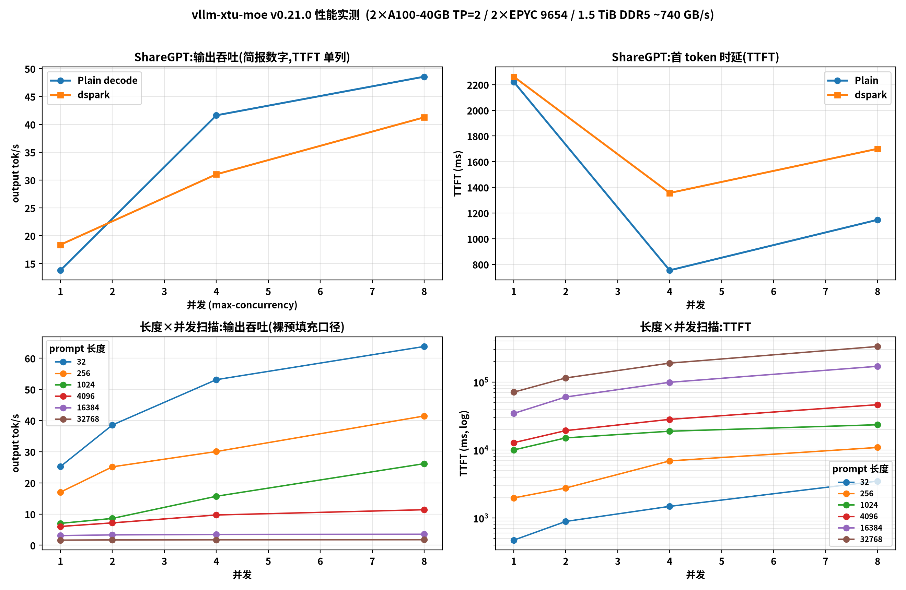

> # ⚠️ 本版本已撤回(2026-09-18)
>
> 用户裁定:中间产物 **`v0.21.0` 撤回**(GitHub Release 与 tag 均已删除),
> 其内容(V4.1-Flash 支持 + GPU 预填充修复)**已并入 **`v0.2`** 发行**。
> `v0.2` 才是交付版:**支持 DeepSeek-V4.1-Flash + CPU 预填充性能优化**。
> 当前有效文档:[`RELEASE_NOTES_v0.2.md`](RELEASE_NOTES_v0.2.md)、[`docs/RUNBOOK.md`](docs/RUNBOOK.md)。
> 本文仅作历史记录保留。

---

# vllm-xtu-moe v0.21.0 — 支持 DeepSeek-V4.1-Flash(748B)

**本次最大的变化:把 DeepSeek-V4.1-Flash 跑成可用的生产配置** ——
**1M 上下文 + GPU 预填充 + 投机解码**全链路端到端验收通过;
其中 GPU 预填充从"能开但更慢、还会 OOM"修成"**能开、快 2.0-2.8×、显存算得准**"。

`v0.21.0` 里程碑(commit `c7ab954`)当时的标注是"**功能完成,性能待优化(不发 release)**"。
本次把那个"待优化"做掉了 —— 因此 0.21 现在可以发行。

---

## 1. 新增:DeepSeek-V4.1-Flash(748B)全链路支持

它是本项目迄今遇到的最"对我们路子"的模型:38.5% 的权重是**纯查找表**(Engram,183 GiB,
每 token 只需 ~12 KB 主机流量),官方生产栈自己就把这张表放在**主机内存**里;
其余部分(CED / CSA2 / FP4 KV / DSpark 投机)由 vLLM 主线的 `deepseek_v41` 提供,
本插件负责 **MoE 层**(把 routed experts 放 CPU)。

**验收结果**(TP=2 / 1M 上下文 / 投机 / 真实权重;完整证据见 `report/tuning/NOTES.md` §570):

| 项 | 结果 |
|---|---|
| 启动 | **388.3 s**(Engram 189 GiB 流式 + 逐层释放) |
| **主机内存峰值** | **629.4 GiB**(ENGRAM_LAST=0 基线 1087.6 GiB,**−42%**) |
| **KV 容量** | **6,724,586 tokens**;1M 请求并发 **6.41×** ⇒ 1M 上下文完整支持 |
| 显存占用 | 35.98 GiB/卡(A100-40GB 内) |
| **服务级 greedy 两次自比** | **5/5 逐字节相同** |
| 单流解码(ShareGPT 16 题 C=1) | **16.64 tok/s,TPOT 36.75 ms** |
| 并发(C=4) | 30.47 tok/s,TPOT 111.19 ms |
| 数值门禁 | `OK=7 BAD=1,max_rel=1.873e-02`(与既有记录逐位一致) |
| 性能门禁 | DEDUP=12 **0.70 ms/层(216 GB/s)**;DEDUP=23 **0.85 ms/层(296 GB/s)** |
| 引擎逐位确定性 | 11 次运行 **10/10** |
| 带载 0 丢票 | `WATCHDOG / abandoned / SLOW parallel_for` 各 **0** 次 |

启动用 `docs/RUNBOOK.md` §5.9 的配置即可(见本文件 §6)。

## 2. GPU 预填充:从"能开但更慢/OOM"到"快 2.0-2.8×"

长 prompt 的预填充一直由 **CPU 引擎**承担(约 **258-285 tok/s**),而
`VLLM_XIAOTU_GPU_PREFILL_MIN_TOKENS` **默认关闭**,因为历史上它要么更慢、要么 OOM。
本节把这条路修到"可开且更快"。

## 3. 关键修复(全部有实测证据;详见 `report/tuning/NOTES.md` §594-§602)

| # | 问题 | 修复 | 证据 |
|---|---|---|---|
| 1 | **字节转置只有 ~90 GB/s** —— K-major 需要对 uint8 做逐字节转置,`transpose(1,2).contiguous()` 退化成 elementwise kernel,4 个张量合计 **42.8 ms/层** | 新增分块 Triton kernel(`byte_transpose.py`,支持 `out=` 原地写) | **6.5 ms/层,快 5-6.9×**,`torch.equal` **逐位相同**;`XIAOTU_GPF_TT=0` 可回滚 |
| 2 | **每层新分配 3.589 GiB**(K-major 输出)+ `inter` 382 MB ⇒ 缓存分配器无法回收 ⇒ `reserved` 单调上涨 ⇒ **free 跌破预检阈值** ⇒ **第 9 层起逐层退回 CPU**(一次 forward 内 GPU/CPU 混合,最坏形态) | ①改用同文件里**早已写好却没用上**的 `_SLOTS` 环形槽(写进复用缓冲);②`inter` 按形状复用 | 指针级:`inter_ptr` 12 层**恒定**;`[gpf-delta] staging_alloc=+0.0 MiB` |
| 3 | **GPU/CPU 判定是"每层模块各判一次"** ⇒ 前半 GPU、后半 CPU | 改为**设备级**(第一个模块的决定即全局) | 日志从"40×`DISABLED`"变为"**80×`ACTIVE`**"(40 层×2 rank) |
| 4 | **`staging_bytes` 只算了 ping/pong 两槽(6.72 GiB)**,漏了 `raw`(3.16)+ DMA 暂存 ⇒ **预检放过了注定 OOM 的配置** | 口径改为真实峰值;**同步路径单槽**(同流有序 ⇒ 安全)⇒ **7.2 GiB**;preflight margin 1.25→1.10 | §600/§601 |
| 5 | **`--enforce-eager` 反而更吃显存** | 明确记录:**不要开**(实测 free 12.95→**1.4** GiB,预填充被拒) | §600(c) |
| 6 | 我们自己发布的 **"1725 tok/s"是无效数据** | **撤回**:该次响应 `chunks=1` 且无 `usage` ⇒ 是错误/截断响应;探针增加校验 | §602 |

## 4. 真实收益(同一服务、同一批唯一 prompt、客户端 TTFT)

| prompt | CPU 预填充(基线) | **GPU 预填充** | 加速 |
|---|---|---|---|
| ~3.7K | 24.17 s → 151 tok/s | **12.11 s → 302 tok/s** | **2.0×** |
| ~7.0K | 42.17 s → 165 tok/s | **15.19 s → 460 tok/s** | **2.8×** |

成本结构(实测):**每个 chunk ≈ 8.9 s 固定 + 0.79 ms/token**。
固定项 = 每个 chunk 都要把 **143.6 GiB/rank** 的专家权重搬一遍(TP=2,40 层 × 3.589 GiB)——
所以 **chunk(MBT)越大越划算**,这也是"预填充吞吐随 prompt 变长而提高"的原因。

## 5. 端到端性能(官方 `vllm bench serve`)

### 5.1 硬件配置(数字必须与它同页,否则无意义)

| 项 | 本机 |
|---|---|
| **GPU** | **2× NVIDIA A100-PCIE-40GB(SM80)**,TP=2,PCIe Gen4 ×16 |
| **CPU** | **2× AMD EPYC 9654 96-Core**(192 核 / 384 线程,SMT 关;NPS4 ⇒ **8 NUMA node**) |
| **内存** | **1538 GiB**;实测聚合带宽 **~740 GB/s** |
| 线程 | `XIAOTU_MOE_THREADS=60`/rank;`SPIN_IDLE_US=300` |
| 软件 | vLLM 主线 `6b5ef34f7b` + 本插件 **v0.21.0**;TP=2 / `--max-model-len 1048576` |

### 5.2 性能摘要(ShareGPT 真实对话;**output tok/s,TTFT 单列**)

口径:`scripts/bench_sharegpt.sh`(`--dataset-name sharegpt`,`--sharegpt-output-len 128`,
`--num-prompts 16`,**前缀缓存开**)。**不用 `random`** —— 随机 token 会让投机解码失效、
前缀缓存无从体现(详见 `report/tuning/BENCH_REFERENCE.md` §8.1)。

**直接公布两个各自独立测量的量**(不做任何折算):

| 并发 | Plain:output token/s | Plain:TTFT (ms) | dspark:output token/s | dspark:TTFT (ms) |
|---|---|---|---|---|
| **C=1** | **13.79** | **2222** | **18.38** | **2262** |
| C=4 | 41.62 | 753 | 31.03 | 1356 |
| C=8 | **48.56** | 1147 | 41.26 | 1700 |

(参考:同批的 TPOT 实测为 Plain 43.22 / dspark 29.45 ms,C=1 —— 也按原样给出,不折算。)

**怎么读**
* **简报数字 = output token/s**(最好值 **48.56**,Plain C=8);**TTFT 单独一列**,不与吞吐混算;
* **投机解码**:C=1 的 output tok/s **13.79 → 18.38(+33%)**,C=8 反而 48.56 → 41.26
  ⇒ 单流有益、高并发下为负(本次实测的新结论);
* **C=1 的 output tok/s(13.79)偏低,主因是 TTFT 2222 ms** —— ShareGPT 平均 prompt 只有
  **227 token**,实测**全部走 CPU 预填充**(~100 tok/s)。这是当前最该攻的点。



### 5.3 裸预填充口径(随机 token,仅用于量预填充本身)


> 口径:`--backend openai-chat`,`--dataset-name random`,`--ignore-eos`,`--random-output-len 128`,
> 预热轮与正式轮**不同 seed**(同 seed 会整段命中前缀缓存,TTFT 假快 —— §603),
> 服务端**关前缀缓存**以量到真实预填充。原始结果:`report/tuning/logs/bench_serve_acc2/`。

| prompt | 并发 | 完成 | 时长 s | 总吞吐 tok/s | 输出吞吐 tok/s | **TTFT ms** | TPOT ms | ITL ms |
|---|---|---|---|---|---|---|---|---|
| 32 | 1 | 2 | 10.1 | 37 | 25.2 | **474** | 36.2 | 35.9 |
| 32 | 2 | 4 | 13.3 | 57 | 38.6 | **892** | 45.1 | 44.7 |
| 32 | 4 | 8 | 19.3 | 79 | 53.1 | **1487** | 64.1 | 63.6 |
| 32 | 8 | 16 | 32.1 | 95 | 63.8 | **3494** | 98.8 | 98.0 |
| 256 | 1 | 2 | 15.0 | 55 | 17.0 | **1980** | 43.6 | 43.3 |
| 256 | 2 | 4 | 20.4 | 81 | 25.2 | **2767** | 58.2 | 57.7 |
| 256 | 4 | 8 | 34.1 | 97 | 30.1 | **6928** | 79.4 | 78.8 |
| 256 | 8 | 16 | 49.4 | 134 | 41.5 | **10918** | 108.3 | 107.5 |
| 1024 | 1 | 2 | 36.5 | 65 | 7.0 | **10031** | 64.6 | 64.1 |
| 1024 | 2 | 4 | 59.6 | 79 | 8.6 | **15093** | 115.4 | 114.5 |
| 1024 | 4 | 8 | 65.2 | 145 | 15.7 | **18906** | 107.6 | 106.8 |
| 1024 | 8 | 16 | 78.2 | 242 | 26.2 | **23569** | 122.3 | 121.4 |
| 4096 | 1 | 2 | 42.5 | 200 | 6.0 | **12837** | 66.3 | 65.8 |
| 4096 | 2 | 4 | 71.3 | 239 | 7.2 | **19310** | 128.5 | 127.5 |
| 4096 | 4 | 8 | 105.5 | 322 | 9.7 | **28246** | 192.6 | 191.1 |
| 4096 | 8 | 16 | 179.7 | 379 | 11.4 | **46435** | 341.0 | 338.3 |
| 16384 | 1 | 1 | 41.5 | 399 | 3.1 | **34548** | 54.4 | 53.9 |
| 16384 | 2 | 2 | 77.0 | 430 | 3.3 | **60219** | 131.4 | 130.4 |
| 16384 | 4 | 4 | 148.1 | 447 | 3.5 | **99065** | 384.7 | 381.7 |
| 16384 | 8 | 8 | 290.5 | 455 | 3.5 | **170285** | 942.9 | 935.5 |
| 32768 | 1 | 1 | 78.4 | 420 | 1.6 | **70943** | 58.4 | 58.0 |
| 32768 | 2 | 2 | 149.8 | 440 | 1.7 | **114729** | 275.4 | 273.3 |
| 32768 | 4 | 4 | 293.4 | 449 | 1.7 | **189537** | 814.7 | 808.4 |
| 32768 | 8 | 8 | 580.3 | 454 | 1.8 | **332939** | 1939.2 | 1924.1 |

**怎么读这张表**
* **总吞吐 tok/s**(含 prompt)在长 prompt 上饱和到 **~420-455 tok/s** —— 这就是 GPU 预填充的
  实际吞吐上界(每 chunk 8.9 s 固定 + 0.79 ms/token);
* **TTFT 随并发明显上升**(L=16384:C=1 34.5 s → C=8 170 s):预填充是**串行共享资源**,
  并发只增加排队,不增加预填充吞吐 —— 这正是"要做 CED/更大 chunk"的动机;
* **短 prompt(L=32/256)TTFT 亚秒级**(474 ms / 1.98 s),走 CPU 路径;
* **L=1024 的 TTFT 10.0 s 偏高**:该组数据是用**旧阈值 1024** 跑的,1K prompt 刚好越过阈值
  而白付了 ~9 s 固定成本。按实测成本模型(`8.9 s/chunk + 0.79 ms/token` vs CPU `3.9 ms/token`)
  **盈亏平衡 ≈2860 token**,所以**推荐阈值已改为 4096**(`vram_policy` 现在直接输出 4096)。


## 6. 推荐配置(详见 `docs/RUNBOOK.md` §5.9)

```bash
TAG=harness PORT=8700 GPUS=0,1 TP=2 MAXLEN=1048576 SEQS=8 MBT=8192 LOAD=auto GPU_UTIL=0.55 \
SPEC=1 COMPILE=0 THREADS=60 SPIN=300 KV_CACHE_BYTES=4294967296 \
VLLM_XIAOTU_GPU_PREFILL_MIN_TOKENS=4096 \
  bash scripts/serve_v41.sh
```
显存配方(TP=2/MBT=8192):非KV 10 + KV 4 + staging 7.2 + 首请求一次性增长 7.7 + 激活 ≈ **33 GiB**。

## 7. 已知限制(必须知道)

* **`MBT` 上限 8192**:`16384` 会 OOM,且 OOM 点是 **attention** 的
  `fused_deepseek_v4_qnorm_rope_kv_rope_quant_insert`(不是 MoE)——40 GB 卡上
  `16K chunk 的激活 + staging` 放不下;
* 开了 GPU 预填充就**必须**按 §5.8 显式封顶 KV 池(`--kv-cache-memory`),
  否则 vLLM 会把显存填满、预填充被逐层拒绝;
* 短期(<1024 token)prompt **仍走 CPU**(固定成本使它更划算),TTFT 约 1-5 s 且随并发上升;
* 剩余优化(未做):把 H2D 从 `cudaLaunchHostFunc` 回调里挪出以与上一层计算重叠;
  让 GEMM 直接读非 K-major 布局以彻底省掉转置与 `raw` 那 3.16 GiB。

## 8. 复现

```bash
# 引擎三门禁(数值 / 性能 / 确定性)
bash scripts/check_engine_aligned.sh
python scripts/test_engine_determinism.py 11
# 预填充曲线(自研诊断探针,已修好尺子:UNIQUE=1 且校验 chunks>=2)
PORT=<port> LENS=4096,8000,16000 REP=2 UNIQUE=1 python scripts/probe_ttft.py
# 官方验收扫描
PORT=<port> TAG=acc2 LENS=32,256,1024,4096,16384,32768 CONC=1,2,4,8 bash scripts/bench_serve_sweep.sh
python scripts/summarize_bench_serve.py report/tuning/logs/bench_serve_acc2
```
