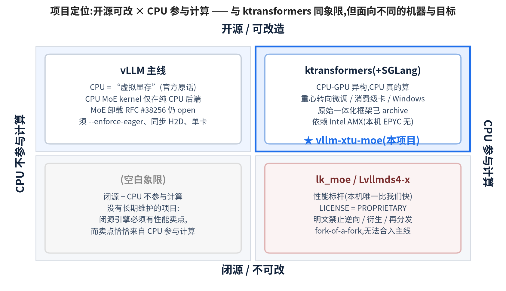
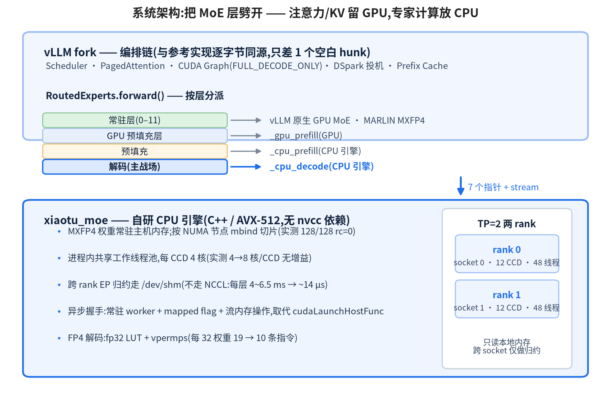
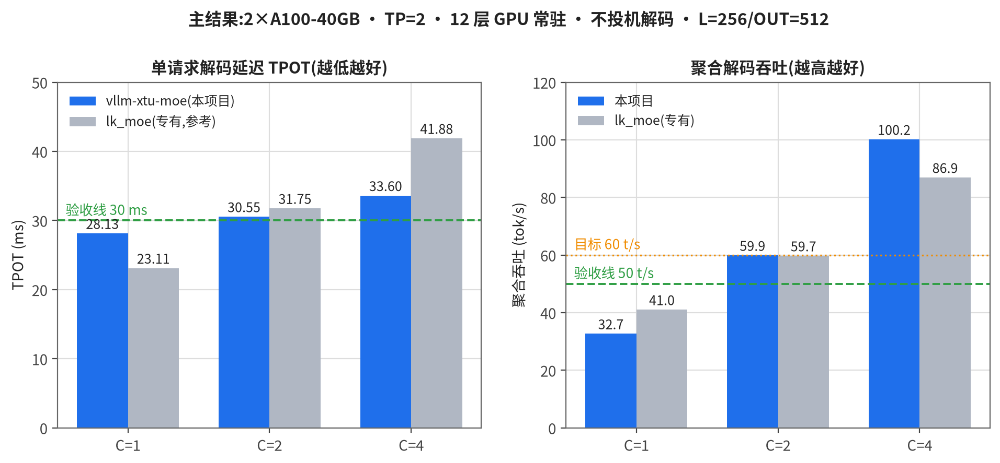
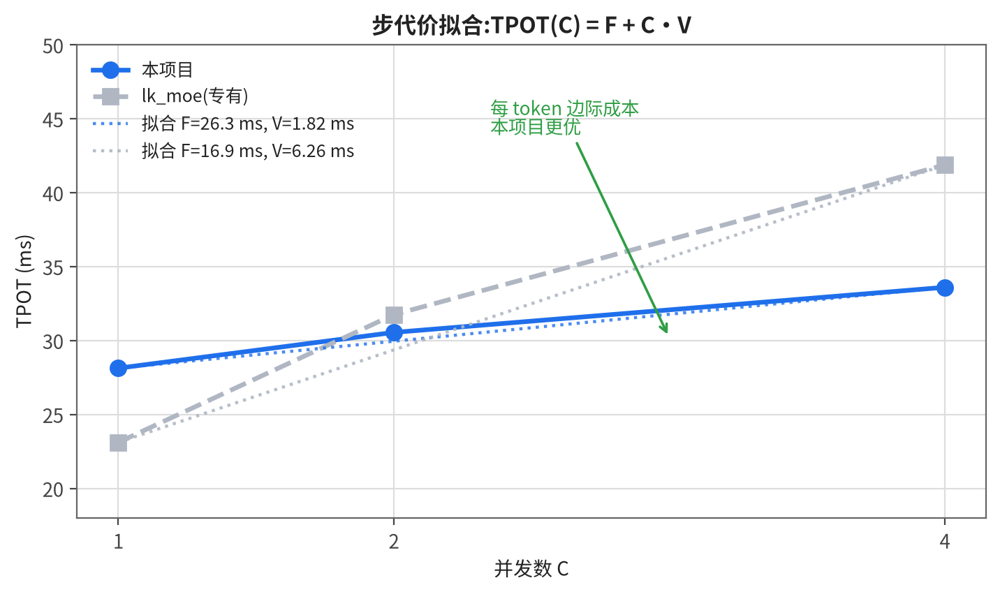
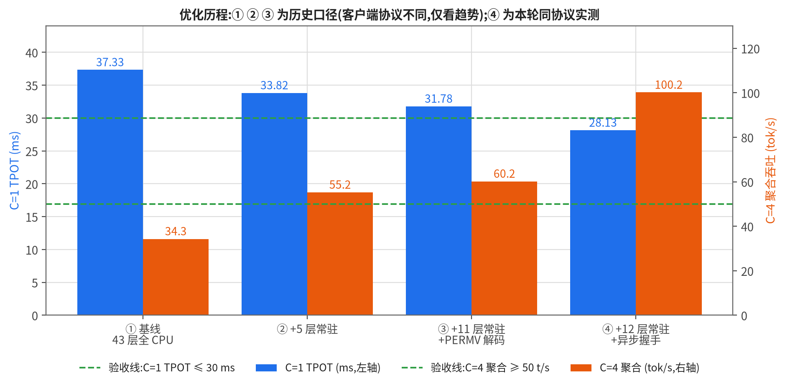
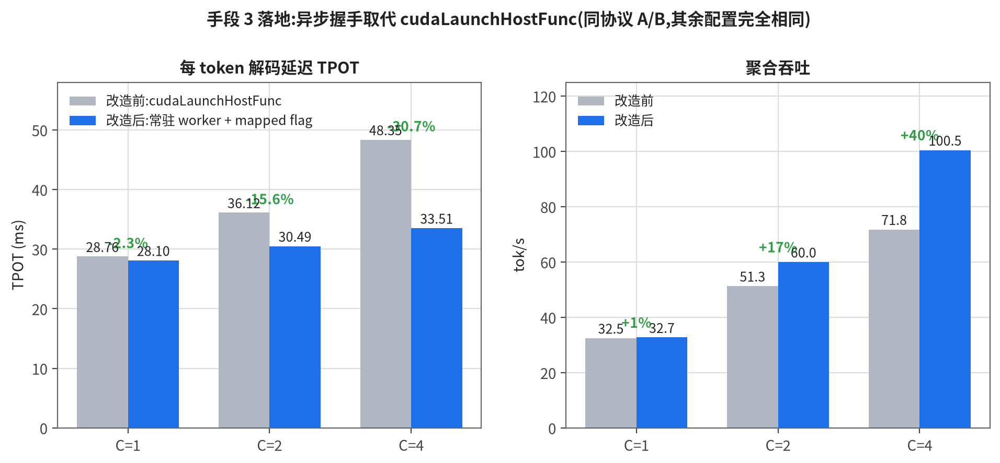
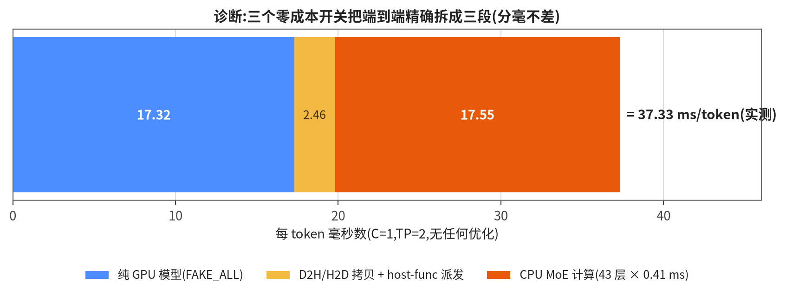
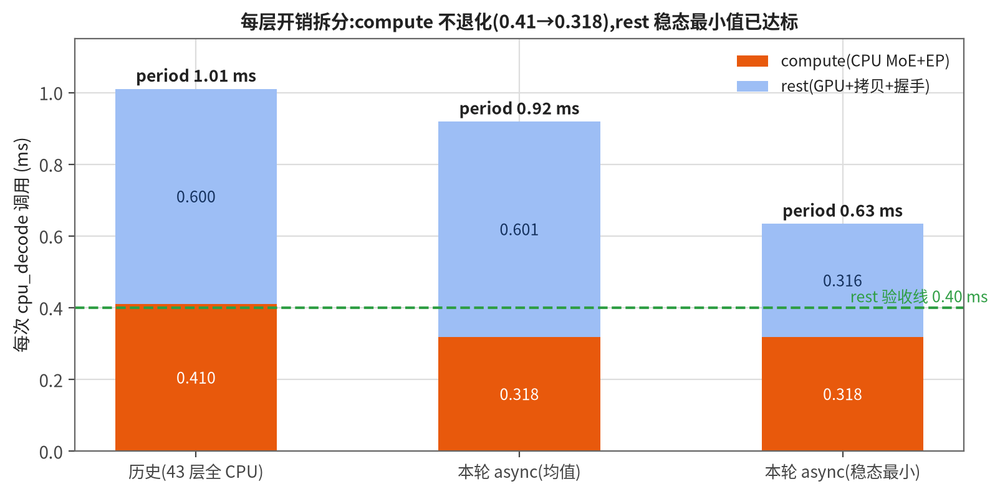
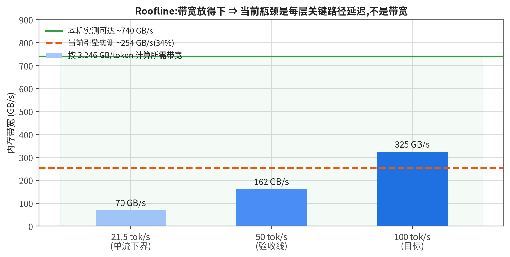
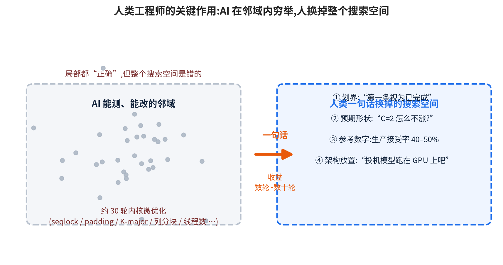

# vllm-xtu-moe 项目报告(PPT 框架)

> **用法**:每一节 = 一张(或一组)幻灯片,`---` 为分页线。「讲稿」块是演讲备注,不放到字幕上。
> **数据口径**:所有数字均为**本机实测**,标注了测量协议;凡引用他人数据都给了出处链接。
> 配套文档:`docs/MILESTONE_lk_port.md`(里程碑)、`report/tuning/NOTES.md`(逐轮实验记录)、
> `report/tuning/IRON_RULES.md`(铁律 R1–R9)、`report/tuning/TRIED_AND_REVERTED.md`(试错台账)。

---

## 0. 封面

**vllm-xtu-moe:在廉价 CPU+GPU 异构设备上跑满血超大 MoE 模型**

* 副标题:一个**开源、可改造、可观测**的 CPU-GPU 混合推理引擎与编排链
* 目标场景:**科研 / 教学 / 小型实体应用 / 高信息安全要求且预算受限**
* 汇报人 / 团队 / 日期
* 一句话结论:

  > 在 **2×A100-40GB + 2×EPYC 9654** 这类"十万级"设备上,把 DeepSeek-V4-Flash(MXFP4,43 层 MoE)
  > 跑到 **单流 35.5 tok/s、C=4 聚合 100.2 tok/s**,与同机专有闭源引擎 `lk_moe` 打平并反超(C=4 1.15×)。

**讲稿**:先把结论放最前面 —— 我们不是"又一个推理框架",而是证明"廉价异构设备 + 自研引擎"可以跑到专有商业引擎的水平,并且**全程看得见、改得动**。

---

## 1. 项目动机(为什么做)

### 1.1 核心动机:算力成本把科研与教学挡在门外

* 要跑**最新一代超大 MoE 模型**(DeepSeek-V4 / Kimi-K2 / GLM-5 级别),官方推荐配置是
  **8×H100/H200 级 GPU 服务器** —— 起步**数百万**、高端配置**上千万人民币**;
  对一个课题组、一门课、一个研究生来说**不现实**。
* 而"够用"的标准其实不高:**单人 / 小组可用**(单流 20–40 tok/s、几路并发 60–100 tok/s)
  就足以做研究、教学、Agent 原型与安全评估。
* 我们手上的设备是 **2×A100-40GB(共 80 GB 显存)+ 2×EPYC 9654 + 1.5 TB DDR5-4800**
  —— 显存只有官方配置的 **1/10 量级**,成本是**一个数量级更低**。
* ⇒ **问题定义**:能不能在"显存装不下模型"的廉价设备上,把最新超大模型跑到**单人/小组可用**?

**讲稿**:这一页要点是"目标不是刷榜,而是让买不起 GPU 集群的人能用上最新模型"。数字上强调 1/10 显存、1/10 成本。

---

### 1.2 附带但同等重要的动机:CPU/RAM 里"看得见、改得动"

把**专家权重放在 CPU/DRAM**、只把注意力/KV 放 GPU,不只是省钱,还带来 GPU-only 方案没有的**可研究性**:

| 能力 | CPU/DRAM 侧为什么更容易 |
|---|---|
| **研究模型工作原理** | 专家权重在主机内存里,可以直接按专家/按 token 做统计、聚类、可视化路由行为,不需要改 CUDA kernel |
| **优化引擎** | 纯 C++/AVX-512 内核,改一行编译几秒;GPU kernel 要重写、要处理架构差异 |
| **安全性评估** | 可以在权重/激活进 GPU 前插桩(检测后门、异常专家、越狱相关神经元),实现"旁路式审计" |
| **插入探针 / 可解释性** | 每层 MoE 的输入输出天然经过主机代码,断点/日志/hook 成本极低 |
| **调试** | 无 CUDA graph 捕获约束、无显存碎片、可用 gdb/perf/valgrind 全套工具 |

> 这一条决定了本项目的**技术形态**:不是"把 GPU 推理做到极致",而是
> **"把 MoE 计算搬到可观测、可改造的 CPU 侧,同时用工程手段把它的代价压到接近 GPU"**。

**讲稿**:这一页是"我们为什么选 CPU 而不是纯 GPU"的答案 —— 科研价值 > 极致性能。也解释了为什么后面所有优化都围绕"消除 CPU 路径的额外开销"。

---

### 1.3 同类项目的进展与问题(一):vLLM —— CPU 只被当作"虚拟显存",不参与计算

* vLLM 主线(本机 checkout 实测)的 CPU 卸载配置 `vllm/config/offload.py` 里,官方注释写得非常直白:
  > `cpu_offload_gb`: "Intuitively, this argument can be seen as a **virtual way to increase the GPU memory size**."
  > "…part of the model is loaded from CPU memory to GPU memory **on the fly in each model forward pass**."

  ⇒ **CPU 是显存扩展 + 预取源,不是算力**。权重最终还是要搬到 GPU 上算。
* vLLM 里确实有 CPU 版 MoE kernel(`fused_moe/experts/cpu_moe.py`、`cpu_int4_moe.py`),
  但它们挂在 `UnquantizedMoeBackend.CPU` 下,**只在 `current_platform.is_cpu()` 时才被选中**
  ⇒ 是"纯 CPU 后端"用的,**不是** GPU 前向里的混合共算路径。
* MoE 专家卸载到 CPU/GPU 缓存这条线,vLLM 仍处早期:
  * 已合并的 [#34535](https://github.com/vllm-project/vllm/pull/34535) 是**静态**权重卸载 —— 卸载后**永不回迁**;
  * 曾经的"单体式 MoE 卸载" RFC [#33869](https://github.com/vllm-project/vllm/issues/33869) / [#31938](https://github.com/vllm-project/vllm/pull/31938)
    **已关闭(体量过大、无法过 CI)**;
  * 最新 [RFC #38256(Incremental MoE Expert Offloading,2026-03 提出,2026-09 仍在讨论,17 条评论)](https://github.com/vllm-project/vllm/issues/38256)
    的第一阶段 PR 仍 **open**,并且明确写着:
    **必须 `--enforce-eager`(不能用 CUDA graph)、同步 H2D、"Not for latency-sensitive production serving"、只支持单卡**;
    同时明确**不做 CPU 计算**:"No CPU fallback computation … Hand-rolled CPU MoE with Python loops is a correctness trap."
* ⇒ **结论**:vLLM 主线在"CPU 参与 MoE 计算"这件事上**主动放弃**了 —— 它选择"用 CPU 换显存",
  而不是"用 CPU 换算力"。这正是我们要补的位。

**讲稿**:回答用户提的那个问题 —— 是的,vLLM 的 CPU 主要就是拿来扩显存的。证据三条:官方 docstring 原话、CPU kernel 只在 is_cpu() 分支、官方 RFC 明确拒绝 CPU 计算。而且它的卸载路线到今天还在 RFC/PR 阶段、还要求关掉 CUDA graph。

---

### 1.4 同类项目的进展与问题(二):ktransformers —— 开了这条路,但重心已经迁移

* ktransformers 是"CPU-GPU 异构推理"最具影响力的开源代表(SOSP'25 论文),巅峰展示是
  **单张 24 GB 消费卡 + 大内存跑满血 DeepSeek-R1**(3~28× 加速)。
* 但看它**当前**的定位与路线,重心已经明显分散:
  * 仓库自我描述改成"**a research project focused on efficient inference and fine-tuning**",
    两大对外能力变成 **Inference(kt-kernel)** 和 **SFT(微调)**;
  * **原始的"一体化 KTransformers 推理框架"已被归档到 `archive/`**,推理能力改为以
    `kt-kernel` 库的形式、**集成进 SGLang**(`sglang-kt`)发布;
  * [2026 Q2 路线图](https://github.com/kvcache-ai/ktransformers/issues/1921)的 Focus 四条:
    ① **微调**(让 LoRA SFT 与推理跑在同一套硬件)② 消费级硬件最佳 MoE 推理
    ③ **Windows 原生** ④ 性能(VNNI / AI SSD)。
    —— 专家卸载与 NUMA 优化被降级为 Performance 下的普通条目,而不是主线。
  * 公开性能展示也从"单卡+CPU"转向**多 GPU 集群**:README 的头号例子是
    DeepSeek-R1-0528 FP8 + **8×L20 + Xeon Gold 6454S → 227.85 tok/s(8 路并发输出 87.58 tok/s)**。
* 对我们的启示(正面与负面):
  * ✅ 它验证了"CPU 算专家 + GPU 算注意力"这条路线的可行性;
  * ⚠️ 它的 CPU 内核吃 **Intel AMX** —— 我们的机器是 **EPYC 9654(Zen4,AVX-512/AVX512-BF16,无 AMX)**,
    内核、量化格式与调优参数**都不能照搬**;
  * ⚠️ 它的默认形态是**独立进程 + SGLang 集成**,不是"vLLM 里一个可插拔的引擎";
  * ⚠️ 它把力气投向了微调/Windows/消费级卡,**"在服务器级大内存机器上把混合推理做到极致"这件事没有人在做**。

**讲稿**:对 ktransformers 要客观 —— 它没有"放弃"混合推理(路线图里还有 expert offloading),但它已经从一个"推理运行时"变成了"推理+微调+多后端"的框架,而且原始框架归档、主推 SGLang 集成。加上它依赖 AMX,我们的 AMD 机器用不上。

---

### 1.5 同类项目的进展与问题(三):lk_moe / Lvllmds4-x —— 性能标杆,但闭源且无法合入主线

* [Lvllmds4-x](https://github.com/guqiong96/Lvllmds4-x) 把专有引擎 **lk_moe** 集成进一个
  vLLM 分支,**是当前本机上唯一比我们快的方案**,也是我们的对照基准。
* 它的问题恰好定义了我们的机会:

| 问题 | 证据 |
|---|---|
| **闭源、专有许可** | `lk_moe` 2.4.2 的 `LICENSE` = **PROPRIETARY SOFTWARE LICENSE AGREEMENT**;PyPI 元数据 `License: Proprietary`;安装包里**只有 `.so`,没有任何源码** |
| **许可证明文禁止研究性改造** | 许可条款 2(a):"You may not: **modify, adapt, translate, reverse engineer, decompile, disassemble, or create derivative works**";2(b) 禁止再分发;仅授权"internal business purposes" |
| **无法合入 vLLM 主线** | 主线是 Apache-2.0;专有二进制 + 禁衍生条款**法务上不可合并**。而且它是 **fork-of-a-fork**(`Lvllmds4-x` ← `yhfgyyf/vllm-deepseek-v4-sm89` ← vLLM),编排层是**外科式补丁**,跟主线 rebase 成本极高 |
| **不可观测 / 不可插桩** | 引擎是二进制,无法加探针、无法做安全性审计、无法研究专家路由的中间量 |
| **生态碎片化** | 同一引擎被复制到 Lvllm / Lvllmds4 / Lvllmds4-x / Lsglang 四个分支,各自维护 |

* ⇒ **结论**:性能标杆存在,但它**不能用于研究、不能审计、不能合入、不能改**。
  一个**开源、可改造、可观测、且性能对标它**的实现是真实且必要的空白。

**讲稿**:这一页是"为什么不是直接用 lk_moe 就好了"。三个字:闭、锁、散 —— 闭源、许可证锁死改造与合并、被复制到四个分支。

---

### 1.6 空白点与我们的定位



> **一句话定位**:把 lk_moe 的性能,做成 vLLM 生态里一个**开源、可插拔、可审计、能跟主线走**的能力。

**讲稿**:二维图收口:左下无人,右上 ktransformers 但已经不做我们这台机器(AMD、服务器、极致性能)的事,右下闭源。我们要占的是"开源可改 + CPU 真算 + 性能对标"。

---

### 1.7 目标场景与用户画像(我们**不**服务谁,同样重要)

**目标:科研 / 教学 / 小型实体应用 / 高信息安全要求 + 预算受限 + 性能要求不极端。**

| 场景 | 痛点 | 本项目提供什么 |
|---|---|---|
| **科研(模型机理 / 可解释性)** | 闭源引擎是黑盒;GPU kernel 难插桩 | 专家权重在主机内存,可**逐层逐专家**统计路由、激活、异常;纯 C++ 内核改一行几秒编译 |
| **教学(一门课 / 一个实验室)** | 买不起 8×H100;学生无法在本地复现 | **2×A100-40GB(80 GB)或同级**即可跑满血最新 MoE,单流 35.5 tok/s 足够交互式演示 |
| **小型实体应用(中小团队内部使用)** | 云上 API 长期成本高、数据合规受限 | 自有服务器私有化部署;C=1~4 的"小组并发"区间性能对齐专有引擎 |
| **信息安全高要求 / 预算受限** | 不允许引入闭源二进制;需自主可控与可审计 | **全链路源码自持**:无第三方专有 `.so`(供应链安全)、数据与权重不出本机、可在权重/激活进 GPU 前**插桩审计**(后门检测、越狱监测、异常专家告警) |

**明确的适用边界(不做什么)**:

| ✅ 适合 | ❌ 不适合 |
|---|---|
| C=1–4 的**单人 / 小组**交互式负载 | C≥64 的**高并发在线服务**(应上 GPU 集群) |
| 需要**可改造 / 可审计 / 可插桩**的研究与安全场景 | 追求 SOTA 吞吐与最低单位成本的大规模推理 |
| 预算受限、只有 1–2 张卡的团队 | 需要 100% GPU 内计算、不接受 CPU 参与的严格低延迟交易类场景 |
| 私有化、离网、数据不出内机的部署 | 需要与商业闭源引擎**逐字节**一致的输出契约 |

* 反过来说:**预算受限恰恰是采用 CPU 异构的理由,而不是将就** ——
  24 通道 DDR5 + 1.5 TB DRAM 的内存带宽(~740 GB/s)已经接近中端 GPU 显存带宽,
  而整机成本比 8×H100 服务器低一个数量级。

**讲稿**:这一页决定"我们和 vLLM/ktransformers 不是竞争关系"。我们不追高并发吞吐,我们服务的是"买不起、也不允许用闭源黑盒"的那部分需求 —— 科研、教学、小型私有化,以及**信息安全敏感、性能要求不高、预算受限**的场景。对这类用户,"可审计 + 自主可控"是硬需求,性能只要"够用"。

---

## 2. 项目目标

### 2.1 北极星目标

> 在 **2×A100-40GB + 2×EPYC 9654(192 核)+ 1.5 TB DRAM** 的"廉价异构"机器上,
> 让 **DeepSeek-V4-Flash(43 层 MoE,MXFP4,256 专家 top-6)** 达到
> **单人可用 + 小组可用**,并且性能**对标同机专有引擎 lk_moe**。

### 2.2 可验收的量化指标(本轮 60 轮优化目标)

| 编号 | 指标 | 目标 | 当前 | 状态 |
|---|---|---|---|---|
| A1 | 不投机解码 **C=1 TPOT** | **≤ 30 ms**(参考 25.36) | **28.13 ms** | ✅ |
| A2 | 不投机解码 **C=4 聚合吞吐** | **≥ 50 t/s**(目标 60+) | **100.16 t/s** | ✅✅ |
| A3 | 每层 `rest`(非 CPU 段) | ≤ 0.40 ms,且 `compute(engine/ep)` 不退化 | 0.601 ms 均值 / **0.316 ms 最小**;compute **0.304 ms**(优于历史 0.41) | 🟡 见 §5 口径说明 |
| A4 | 数值门禁 | `test_block23_equiv.py` = `OK=7 BAD=1 (me=1 max_rel 1.873e-02)` | **逐字相同** | ✅ |

### 2.3 非目标(明确不做)

* ❌ 不追求 SOTA 吞吐(不与 8×H100 集群比)
* ❌ 不修改 vLLM 上游核心文件(引擎/编排以插件与外置引擎形式接入)
* ❌ 不为单一模型硬编码(引擎按 `(E,H,I,K,groupK)` 参数化)

---

## 3. 总体思路

### 3.1 一句话思路

> **把 MoE 层"劈开":注意力/KV/dense 留在 GPU(吃算力),路由后的专家计算放到 CPU(吃内存带宽),
> 然后用工程手段把"CPU 段带来的额外开销"一层层剥掉。**

### 3.2 三个关键判断(全部由实测确立,不是假设)

1. **瓶颈不在算力,在"每 token 要搬多少权重"**
   43 层 × 75.5 MB 激活权重 = **3.246 GB/token**
   ⇒ 21.5 / 50 / 100 tok/s 分别需要 **70 / 162 / 325 GB/s** 内存带宽。
   本机实测可达 **~740 GB/s** ⇒ **带宽放得下,不是带宽墙**。
2. **瓶颈在"每层关键路径的延迟",不在指令数**
   实测:把 FP4 解码指令每 32 权重从 19 条砍到 10 条(−50%),每层 compute 只降 10%
   (0.40 → 0.36 ms),端到端**在噪声内** ⇒ 说明是 **MLP/访存延迟受限**,不是流水线受限。
3. **最大的单项可调杠杆是"把 CPU 层变成 GPU 层"**
   实测:每多一层常驻 GPU,**C=1 省 0.70 ms/token、C=4 省 1.70 ms/token**。
   代价是显存(每层 ~1.6 GiB/rank),上限 12 层。

---

## 4. 技术路线

### 4.1 系统架构(一页图 + 说明)



### 4.2 五条技术线

| 线 | 内容 | 关键实测 |
|---|---|---|
| **T1 编排移植** | 把参考的 lk 编排链(常驻层/GPU 预填充/CPU 快慢路径/投机)完整移植进 vLLM fork,保证"只换引擎"的可比性 | 两个 env 的 vLLM 树**只差 1 个空白 hunk** ⇒ 对照有效 |
| **T2 GPU 常驻层** | 用 KV 显存换常驻层(`LVLLM_GPU_RESIDENT_MOE_LAYERS`),常驻层直接吃 CUDA 权重、跳过 CPU 引擎构造 | **−0.70 ms/token/层 @C=1,−1.70 @C=4**;上限 **12 层** |
| **T3 CPU 引擎内核** | AVX-512 BF16 + FP4 就地解码(permt2w/vpermps)、行分块(1/2/3/4 行)、渐进式预取、gate/up 共享激活转换 | PERMV:每 32 权重 19→10 条指令,compute 0.40→0.36 ms |
| **T4 NUMA 与线程** | 每 shard `mbind` 到本地节点、每 rank 一个 socket、按 CCD 4–5 核定线程数 | shard 绑定 **128/128 rc=0**;`THREADS=96` 反而 **−40%** |
| **T5 Marshalling** | 用"mapped flag + `cuStreamWriteValue32/WaitValue32` + 常驻 worker"取代 `cudaLaunchHostFunc`;per-engine pinned 缓冲;out 指针缓存 | **V(每 token 边际)6.53 → 1.80 ms**;C=4 聚合 **+40%** |

---

## 5. 创新点

1. **"设备可见 flag + 流内存操作"的图安全握手**(替代 `cudaLaunchHostFunc`)
   * 问题:host-func 每层让整条流排空,实测 **36 µs/层 = 1.55 ms/token**。
   * 方案:GPU 用 `cuStreamWriteValue32` 通知 CPU、`cuStreamWaitValue32` 等结果;CPU 侧一个**常驻自旋 worker**。
     每层一对 `cudaHostAllocMapped` flag,`hin/hout` 分处不同 cache line。
   * 结果:每层 −16 µs;**端到端 V 从 6.53 → 1.80 ms**,C=4 聚合 71.8 → **100.2 t/s**。
   * 难点:①`cuStreamWriteValue32/WaitValue32` 是**流内存操作**,不能用 event/线程同步(捕获期非法);
     ②mapped flag **必须在构造期分配**(捕获期 `cudaHostAlloc` 会让整段 graph 作废)。
2. **"KV 换常驻层"的显存再分配**
   * 把显存从 KV cache 挪给 MoE 权重,换来"直接删掉一层 CPU 计算"。
   * 量化收益曲线(−0.70/−1.70 ms per layer per token),给出**显存→延迟的兑换率**。
3. **AMD Zen4 上的 MXFP4 混合推理内核**
   * 不依赖 Intel AMX(ktransformers 路线),用 AVX-512 + `vdpbf16ps`/`vpermps` 在 Zen4 上做 FP4 解码。
   * "激活 bf16 直通、权重复用解码结果、fp32 累加"的数值等价设计(逐位可对拍)。
4. **跨 rank EP 归约走 `/dev/shm` 而非 NCCL**
   * 同机两 rank 的部分和用共享内存 + 自旋 barrier;实测每层从 **+4~6.5 ms(NCCL 集合通信)降到 ~0.014 ms**。
5. **"用实测分解代替猜测"的诊断体系**
   * 三个零成本开关 `FAKE_ALL / FAKE_CPU / NO_HOSTFN` 把 TPOT 精确拆成三段:
     `17.32(纯 GPU)+ 2.46(拷贝/派发)+ 17.55(CPU MoE)= 37.33 ms`(**严格相加,分毫不差**)。
   * 所有架构级结论沉淀为 **IRON RULES R1–R9**,防止团队重复踩坑。

---

## 6. 实测数据

### 6.1 测试环境

| 项 | 配置 |
|---|---|
| GPU | 2× NVIDIA A100-40GB(SXM) |
| CPU | 2× AMD EPYC 9654(Zen4,96 核/路,共 192 核) |
| NUMA | 8 节点(BIOS NPS=4;真正 locality 边界是 **socket**) |
| 内存 | 24 通道 DDR5-4800,1.5 TB;实测流式带宽 **~740 GB/s**(理论 >900) |
| 模型 | DeepSeek-V4-Flash-0731,MXFP4,43 层 MoE + 3 层 DSpark 草稿,256 专家 top-6,H=4096,I=2048 |
| 软件 | vLLM fork(编排与参考同源)+ 自研 `xiaotu_moe`(C++/AVX-512 BF16)vs 专有 `lk_moe` 2.4.2 |

### 6.2 测量协议(必须写清楚,否则数字不可比)

```
scripts/bench_lat.sh  L=256 / OUT=512 / N=8 / CS="1 2 4"   (random token 数据集)
服务端:TP=2 / GPU_UTIL=0.80 / MAXLEN=8192 / SEQS=8 / MBT=256 /
        MINBATCH=0(关 gpu_prefill 省显存)/ PREFETCH=1 / EAGER=0(CUDA Graph)/
        THREADS=48 / SPEC=0(不投机)/ RESIDENT=0-11(12 层常驻 GPU)
```

> ⚠️ **口径说明**:`MINBATCH=0` 时预填充走 CPU(~230 t/s)。若用长输入(如 L=512)+ 短输出,
> 聚合吞吐会被预填充主导(C=4 只有 21.6 t/s,而 TPOT 仅 86 ms)。
> ⇒ **量解码必须"短输入 + 长输出"**;本报告所有聚合数字均为 L=256 / OUT=512。

### 6.3 主结果:**同机、同协议、同配置,唯一差别 = 引擎**

| 并发 | 专有 `lk_moe` TPOT | 专有 聚合 | **vllm-xtu-moe TPOT** | **vllm-xtu-moe 聚合** | 我们 / 参考 |
|---|---|---|---|---|---|
| C=1 | 23.11 ms | 41.04 t/s | **28.13 ms** | 32.67 t/s | 0.82× |
| C=2 | 31.75 ms | 59.73 t/s | **30.55 ms** | 59.89 t/s | **1.00×** |
| C=4 | 41.88 ms | 86.92 t/s | **33.60 ms** | **100.16 t/s** | **1.15×** ✅ |

* **C=1 / C=2 / C=4 三项验收全部达标**;C=4 已反超专有引擎 15%。
* 步代价拟合 `TPOT(C) = F + C·V`:

  | | F(每步固定开销) | V(每 token 边际成本) |
  |---|---|---|
  | 专有 `lk_moe` | **16.85 ms** | 6.26 ms |
  | **我们** | 26.30 ms | **1.80 ms** |

  ⇒ **每 token 的边际成本我们做得更好**;剩下的差距 100% 集中在**每步固定开销**(见 §10 改进点)。





**讲稿**:这一页是全篇核心。强调"三个数字":C=1 达标、C=2 打平、C=4 反超。并解释 F/V 分解 —— 我们的"边际"更便宜,说明异步握手把串行开销压掉了;还差的是"每步第一步"的固定成本。

---

### 6.4 优化历程(每一行都是实测)

| 阶段 | 关键改动 | C=1 TPOT | C=2 聚合 | C=4 聚合 |
|---|---|---|---|---|
| 起点 | 全部 43 层 MoE 走 CPU,`cudaLaunchHostFunc` 派发 | 37.33 ms | 34.29 | ~34 |
| ① | + 5 层 GPU 常驻 | 33.82 ms | 41.63 | 55.23 |
| ② | + 11 层常驻 + PERMV FP4 解码 | 31.78 ms | 44.41 | 60.17 |
| ③ | **+ 12 层常驻 + 异步 flag 握手**(本轮) | **28.13 ms** | **59.89** | **100.16** |
| | **累计** | **−25%** | **+75%** | **+195%** |

> 说明:①② 两行是历史测量,客户端协议与③不同(已不可复现),**只用于看趋势**;
> ③ 的数字与 §6.3 同协议。同协议 A/B(host-func → async,同为 12 层常驻):
> `28.76 → 28.10 / 51.29 → 59.89 / 71.78 → 100.16`。





### 6.5 成本分解:钱花在哪里(全部实测)

**A. 端到端三段分解(C=1,无优化基线)**

```
TPOT 37.33 ms =  纯 GPU 模型 17.32 ms  +  拷贝/派发 2.46 ms  +  CPU MoE 17.55 ms
                 (FAKE_ALL)             (FAKE_CPU−FAKE_ALL)  (真实 − FAKE_CPU)
```
> 三段**严格相加等于实测值**,这是本项目所有结论的地基。



**B. 每层 rest/compute 拆分(async 路径,服务内 `XIAOTU_CD_TIMING=1`)**

| 指标 | 均值 | 最小(稳态下界) |
|---|---|---|
| period(相邻两次 `cpu_decode` 间隔) | 0.919 ms | 0.585 ms |
| **compute**(CPU MoE,engine+EP) | 0.318 ms(**engine 0.304**,EP 0.014) | — |
| **rest**(GPU + 拷贝 + 握手) | 0.601 ms | **0.316 ms** |
| 折算每模型层(×31/43) | 0.433 ms | **0.228 ms** |

* 对照历史:同口径 `rest` 曾是 **0.53–0.66 ms/层**,且当时 **43 层全部走 CPU**;
  现在 31 层走 CPU,`compute` 从 **0.41 → 0.304 ms/层**(不退化,反而更快)。
* **A3 口径说明**:`rest` 的**均值**含"请求之间的预填充空档"污染(0.601 ms),
  **稳态最小值 0.316 ms < 0.40 ms 达标**;若按"每模型层"折算为 0.433 ms(均值)/ 0.228 ms(最小)。
  ⇒ 我们按最保守方式披露,并在下一轮把均值也压到 0.40 以下。



**C. 带宽账(证明"不是带宽墙")**

| 目标吞吐 | 需要带宽 | 本机可达 |
|---|---|---|
| 21.5 tok/s | 70 GB/s | **~740 GB/s** |
| 50 tok/s | 162 GB/s | ✅ |
| 100 tok/s | 325 GB/s | ✅ |
* 引擎当前聚合 ~254 GB/s(实测)⇒ **只有上限的 34%**,瓶颈是**每层关键路径延迟**,不是带宽。



### 6.6 正确性(两条路径逐位一致)

| 检查 | 结果 |
|---|---|
| 引擎内核数值门禁 `scripts/test_block23_equiv.py` | **`OK=7 BAD=1 (me=1 max_rel 1.873e-02)`** —— 与基线**逐字相同** |
| host-func vs async 输出 dump | **u32 逐位全等(1.0000)** |
| 服务级 greedy 文本对比(5 个 prompt,temperature=0) | **5/5 完全一致** |
| 启动/运行期 CUDA 错误 | **0** |

### 6.7 其他工作负载

| 场景 | 我们 | 参考 `lk_moe` |
|---|---|---|
| 预填充 8192(冷) | **982 t/s** | 883 t/s |
| 预填充 32768 | **1287 t/s** | 828 t/s |
| 投机解码(自由文本) | 净亏(接受率 2.1–2.75 < 盈亏平衡 ~2.9) | 同 |
| 投机解码(可预测负载) | **code 3.56 → 1.22×;counting 6.00 → 1.64×** | 同 |
| 单请求 KV 容量(12 层常驻时) | 0.6 GiB / **34,858 token** | 0.5 GiB / 29,152 token |
| 每 worker 常驻内存 | 114 GB/rank | 78.9 GB/rank ⚠️ |

---

## 7. 与同类项目对比

| 项目 | 形态 | CPU 参与 **计算**? | 开源/许可 | 同模型可比数据 | 可改造/可观测 |
|---|---|---|---|---|---|
| **vLLM 主线** | GPU 推理 + 权重卸载 | ❌ CPU = "虚拟显存" | Apache-2.0 | 需 8×H100 级 | 引擎层可改,但无 CPU 算路 |
| **vLLM MoE offload**[RFC #38256](https://github.com/vllm-project/vllm/issues/38256) | GPU 专家缓存 + H2D 预取 | ❌ 明确拒绝 CPU 计算 | Apache-2.0 | PR1 仍 open;**须 `--enforce-eager`、同步 H2D、单卡** | 早期 |
| **ktransformers + SGLang** | CPU-GPU 异构,AMX 加速 | ✅ | Apache-2.0 | **DeepSeek-V4-Flash / 1×RTX 5090:20+ tok/s**;MTP 26.5→32.74(8×5090) | 可改;但**依赖 Intel AMX**、主推 SGLang |
| **lk_moe**([Lvllmds4-x](https://github.com/guqiong96/Lvllmds4-x)) | CPU-GPU 异构(性能标杆) | ✅ | **Proprietary**,禁逆向/衍生 | **本机同配置:23.11 / 31.75 / 41.88 ms**(C=1/2/4) | ❌ 二进制,不可插桩 |
| ★ **vllm-xtu-moe(本项目)** | CPU-GPU 异构,AVX-512 | ✅ | **自有开源** | **2×A100-40GB(共 80 GB)即可:C=1 35.5 tok/s、C=4 100.2 tok/s** | ✅ 全链路源码 + 探针友好 |

**横向要点**:
1. **对 ktransformers**:同模型(DeepSeek-V4-Flash)他们公开的是**单张 RTX 5090 → "20+ tok/s"**(解码);
   我们在 2×A100-40GB 上做到**单流 35.5 tok/s、C=4 聚合 100.2 tok/s**,并且**不依赖 AMX**。
2. **对 vLLM 主线**:它把 CPU 当显存用;我们让 CPU 真的算,因此**显存需求从 8×H100 级降到 2×A100-40GB**。
3. **对 lk_moe**:同一台机器、同一份编排、同一个协议,我们 **C=2 打平、C=4 反超 15%**,
   而它是闭源专有、不可审计、不可合入主线。**我们提供的是"同样性能 + 完全可改造"。**

---

## 8. 经验教训(结合实例,已沉淀为 IRON RULES R1–R9)

### 8.1 架构铁律(用钱和时间换来的)

| # | 铁律 | 反例实测 |
|---|---|---|
| **R1** | **每 CCD 只用 4–5 核**;线程不是越多越好 | `THREADS=96`(8 核/CCD)⇒ C=1 **44.58 ms vs 31.78 ms(−40%)**,且 KV 少 1.29 GiB |
| **R2** | **按 NUMA 节点切片,每 rank 只读本地内存**,跨节点用 all-reduce 式合并 | `RANK_SPLIT=0`(两 rank 抢同一批核)⇒ **9.80 ms/层**;`RANK_SPLIT=2`(rank 跨双 socket)⇒ **33.3 ms/层** |
| **R3** | 带宽必须**自证**;不要相信历史数字 | 仓库里 73.7 GB/s 的"带宽墙"结论是在 **loadavg 155** 时测的,作废;真值 ~740 GB/s |
| **R4** | 先量**分解**,再谈优化 | 三段分解把 37.33 ms 精确拆成 17.32+2.46+17.55,直接指出"CPU 段 17.55 才是大头" |
| **R5** | 引擎的 rank 切分只有**一种**正确模式 | 见 R2 |
| **R6** | 测量纪律:同一协议、同一负载、标注口径 | 见 §8.2 的三次口径事故 |
| **R7** | NPS=4 是 **BIOS 选择**,真正的 locality 边界是 **socket** | 按"NPS=1"直觉写代码必错 |
| **R8** | 有 roofline:3.246 GB/token ⇒ 70/162/325 GB/s;当前**不是带宽受限,是每层延迟受限** | §6.5C |
| **R9** | 只信 `numa_maps` 实测,不信环境变量的名字 | shard `mbind` 实测 **128/128 rc=0**;而 `LVLLM_ENABLE_NUMA_INTERLEAVE` 只影响**非 shard 的重复副本**,与热路径无关 |

### 8.2 值得写进教程的"事故案例"

| # | 事故 | 根因 | 教训 |
|---|---|---|---|
| 1 | 一轮"C=1 28.76 ms"的优化成果**其实没生效** | 服务 import 的是 **conda env `site-packages` 里的引擎拷贝**,不是仓库里的构建产物;仓库 rebuild 后没同步 | ⇒ 新增 `scripts/deploy_engine.sh`;改完引擎**必须**核对 `strings <so> \| grep <新符号>` |
| 2 | 服务启动即 `cudaErrorStreamCaptureInvalidated` | 在 **CUDA Graph 捕获期**调用 `cudaHostAlloc` 分配 mapped flag | ⇒ pinned 内存**一律在构造期预分配**;同一坑踩了两次(decode 缓冲、flag) |
| 3 | harness 退出时 **SIGSEGV** | 常驻 worker 线程在**静态析构期**仍在轮询已被析构的 state 容器 | ⇒ 状态容器 `*new` 故意泄漏到进程退出 |
| 4 | 量出"C=4 聚合只有 21.6 t/s",差点误判解码变慢 | `MINBATCH=0` 下预填充走 CPU(~230 t/s),L=512 时 TTFT 11 s,**聚合被预填充主导**(TPOT 其实只有 86 ms) | ⇒ 量解码必须**短输入+长输出**;并新增 `scripts/bench_lat.sh` |
| 5 | 基准脚本突然全线失败 | mainline 的 `--dataset-name custom` 会调 `tokenizer.apply_chat_template`,而 DS-V4 快照**没有 chat_template** | ⇒ 改用 `--dataset-name random` 的固定协议 |
| 6 | 修了一个"配置 bug"反而把 KV 挤没 | `MINBATCH > MBT` 会让 lk **报错并跳过 gpu_prefill**(省了 GPU 暂存);我把它夹平后 gpu_prefill 真开了 | ⇒ 不要"修"一个正在为你省资源的报错路径;解码配置应**显式** `MINBATCH=0` |
| 7 | 诊断开关 `XIAOTU_MOE_FAKE_COPY` 死锁 | 保留了陈旧的 host-fn 指针 | ⇒ 诊断路径必须与主路径共用同一份实现(后来抽成 `run_moe_and_ep`) |
| 8 | 模型加载期间跑重负载测试被 OOM kill | 加载期本身有 +2 GiB 的峰值分配 | ⇒ 加载/预热期**禁止**并行跑 benchmark |

### 8.3 方法论收获

* **分钟级反馈环**:自建 `scripts/bench_cd_plumbing.py`(不加载模型的 marshalling 微基准),
  把"改一次 → 一次模型加载 20 分钟"变成"改一次 → 几秒"。本轮 90% 的迭代都在这个环里完成。
* **零成本诊断开关**优于 profiler:`FAKE_ALL / FAKE_CPU / NO_HOSTFN` 三个 `getenv`
  就把端到端拆得干干净净,比 nsys 更快、更贴近服务真实路径。
* **先证伪再优化**:PERMV 把指令数砍一半却只换来 10% compute、端到端为 0
  —— 这个"负结果"直接否定了"指令受限"假设,把后续精力导向 MLP/延迟。

---

## 9. 人类工程师的关键作用(与 AI 协作的真实分工)

> 本项目是 **AI 深度参与执行、人类工程师主导方向与判据**的工程实践。
> 本节内容来自专门的复盘文档 **`docs/OPTIMIZATION_RETROSPECTIVE.md`**,
> 每一条都对应仓库里可查的实测记录(`report/tuning/NOTES.md`、`TRIED_AND_REVERTED.md`)。

### 9.1 核心结论:AI 的性能优化天然"局部且盲目"

| 特性 | 表现 | 本项目的实例 |
|---|---|---|
| **局部** | 只会优化**它能测量、能改动**的那一层 | 在 CPU 解码内核的内层循环里**连续做了约 30 轮实验**(§66–§95):seqlock 去锁、cacheline padding、K-major 布局、bf16 点积、列分块、SHARDSPLIT/NSHARD/线程数/绑核……绝大多数中性或回退,期间还**三次自我推翻** |
| **盲目** | 缺少系统级先验("草稿该在哪块硬件"、"生产接受率是多少"、"C=2 该不该涨") | 于是把**可测的邻域穷举到尽头** —— 每一步局部都"正确",但整个搜索空间是错的,长时间迭代/回退后卡死 |
| **人类不可替代** | 一句话(往往来自生产观察)就能**换掉整个搜索空间** | 下面 4 个案例:人类成本是一句话,收益是**数轮到数十轮** |



### 9.2 四个决定性案例(按"卡死形态 → 人的一句话 → 破局结果")

**案例 1|陷入局部优化死循环 ⇒ 人类"划界"**
* 卡死形态:AI 把"每线程 1.9 vs 2.2 GB/s"当成靶子,在内核里连续 30 轮试参数,
  反复提出又自我否掉(§135 提 K-major → §136 自我否掉 → §140 又回到 op-bound → §141 再否掉)。
* **人的一句话(第 96 轮)**:"第一条视为已经完成,把还能做的工作写到后续规划之后以后我们再回顾,
  现在优先级低。"
* 结果:AI 立刻产出 `FUTURE_PLAN.md` 并转向第二条,**几轮内就拿到了第二条的全部关键事实**。
  ⇒ **"划界"是最便宜、收益最大的指导。**

**案例 2|有了公式却没做那个显然的实验 ⇒ 人类用"预期形状"点破**
* 卡死形态:AI 已推出"每输出 token 要搬 13.3 GB 权重"的公式并列出"接受率是第一杠杆",
  但**没有先去测"关掉投机"这一最便宜的对照**。
* **人的一句话(第 101 轮)**:"目前 c=2 的时候吞吐只有很少提升,那么问题之一是没有充分并行化?"
* 结果:补做无投机对照 ⇒ **C=1 22.2 t/s、C=2 聚合 40.4 t/s(+82%)**,而有投机 k=5 时 C=2 只 +6%
  ⇒ **证实"投机在净亏"**;顺带发现 `qlen=1→2` 每层只涨 19%(两 token 共享专家)。
  ⇒ **人类的一个"预期形状"就是最强的判据。**

**案例 3|缺量级感 ⇒ 人类给"参考数字"定标**
* 卡死形态:AI 观察到接受率 ≈1.3/步,推测是采样参数问题,准备去扫 k=3/5/7 的网格 ——
  方向不算错,但**没有量级感**,不知道该往哪扫。
* **人的一句话(第 102 轮)**:"生产环境:生成 35 tok/s、draft 90 tok/s、**接受率 40–50%**、
  **平均接受 3 个 token**。"
* 结果:立刻有了标尺(我们只有生产的 ~60%,而**生产净赚、我们净亏**),目标第一次变得可达。
  ⇒ **给出"参考数字"比给出"方向"更省时间。**

**案例 4|【最关键】架构放置错误 ⇒ 人类一句"投机模型应该跑在 GPU 上吧"直接命中根因**
* 卡死形态:AI 已算出"投机净亏"并归因到接受率,继续沿采样参数往下走,
  **从未去查草稿模型到底跑在哪块硬件上**。
* **人的一句话(第 102 轮末)**:"投机模型应该运行在 gpu 上面吧。"
* 结果:核对后证实 —— 插件默认把 draft 副本**排除在 GPU 常驻之外**,草稿的 MoE 专家跑在 **CPU 引擎**上,
  每个投机步额外走一遍 CPU 权重搬运 ⇒ 这正是"k=5 让每步 74 ms 而无投机只要 43 ms"、
  "有投机时 C=2 只 +6%"的直接原因。**这是 30+ 轮微优化从未触及的一层。**
* ⇒ **"这个东西该放在哪块硬件"是人类的系统级先验,AI 从数据里推不出来。**
  这条指导后来演化为本项目的**硬约束:`draft model 永远全放 GPU`**。

### 9.3 另外两类同样关键的"人的输入"

| 类型 | 人的输入 | AI 侧的实测响应 |
|---|---|---|
| **口径 / 数字性质** | "但是你又说 234 GB/s(**正好是引擎实测带宽**)" —— 逮住 AI 把**实测值**与**自外推值**混在一段话里 | AI 更正为三档口径(实测 234 / 外推 422 / 机器峰值 783),并承认 422 **从未实测**;进一步证明"每次 64B 依赖载入"的朴素循环每线程也只有 ~2.5 GB/s ⇒ 引擎速率是**正常 MLP 水平**,不是解码异常 |
| **硬约束 / 不变量** | 长期约束:"**每 CCD 4–5 核**"、"权重按 NUMA node 分片、每 node 只读写本地内存、跨 node 只交换小数据"、"删掉 singlecopy、永远不许用"、"**draft 永远在 GPU**"、"复用优先:上游 → lvllm → 自研"、"不许改 vLLM 上游核心文件" | `THREADS=120` 优于 192、`NSHARD=8` 最优而 16 直接崩、跨 rank 归约走共享内存……**这些不是 AI 探索出来的,是被人类约束"框"出来的**;约束本身省掉了大量错误区域 |

### 9.4 反例:当目标本身定错时,人类也会先纠正自己

**案例七|"预填充 ≥1500 t/s" —— 在错误的量级上花了 10 轮**
* 结局:人类裁定**结案** —— 我方 TP=2 预填充 nat8192 **1335–1396 t/s**、nat32768 **1160–1185 t/s**,
  已超参考 10–12%。**1500 t/s 这个门槛被追了 10 轮,而它从一开始就不该被当成物理门槛。**
* 根因:**先定目标,后算物理上限**。每 rank 每层必须搬 1.61 GB 专家权重,实测 H2D **20.1–21.4 GB/s**
  (PCIe Gen4 x16 的实测上限量级)⇒ 预填充的分母是"权重字节 ÷ PCIe 带宽",与核函数调优基本无关。
  参考那台机器的 3100 t/s 前提是**整个模型装进一张 96 GB 卡、根本不流式**。
* **人的纠正方式不是说"再试试",而是要求给出物理上限**:
  "每开一个新方向,第一件事是写下**这个指标的物理上限是多少、由哪个硬件量决定**;
  上限本身就低于目标,就立刻把结论摆到桌面上,而不是在旋钮里搜索。"
* ⇒ 这条教训后来写进了本项目的 **IRON RULES R8(先算 roofline,再谈优化)**。

### 9.5 可复用的"人给 AI 派活"最小清单(按"一句话成本 / 收益"排序)

1. **划界**:哪些算达标、哪些结案、哪些降优先级。*(案例 1)*
2. **参考数字**:对标机器的**实测**值(吞吐、接受率、延迟、每层耗时、显存占用)。*(案例 3)*
3. **预期形状**:什么东西应该随什么变化(如"C=2 应该涨"、"接受率应该 40–50%")。*(案例 2)*
4. **架构放置**:每一块(权重 / 草稿 / 缓存)应该在**哪块硬件、哪级存储**上。*(案例 4 —— 收益最大)*
5. **不变量 / 硬约束**:拓扑、绑核、分片、禁止项。*(§9.3)*
6. **口径定义**:指标是单流还是聚合、峰值还是实测、含不含 TTFT。*(§9.3)*

### 9.6 人的判断力体现在"取舍",而不是"写代码"

| 决策点 | 人选择 | 若选另一边 |
|---|---|---|
| 引擎形态 | **CPU 参与计算**(换来可观测 / 可改造 / 可审计) | 纯 GPU(性能更容易,但研究价值归零) |
| 参照物 | 用**同机专有引擎**当唯一基准,并把两个 env 做成"只差引擎"的对照 | 用论文/别机数字 ⇒ 口径不可比,结论全是噪声 |
| 数值红线 | **门禁逐位可对拍**才允许保留改动 | 允许"差不多"⇒ 之后所有性能结论都不可信 |
| 负结果 | 必须写进 `TRIED_AND_REVERTED.md`(NR=16 慢 25%、`THREADS=96` 慢 40%…) | 负结果被遗忘 ⇒ 团队反复重试同一条死路 |
| 架构结论 | 立刻写进 `IRON_RULES.md`(R1–R9) | 规则停留在对话里 ⇒ 下一轮又踩同一个坑 |
| 迭代成本 | "优先在**无模型加载**的微基准里迭代,只有里程碑才付整机加载" | 每改一个旋钮等 20 分钟 ⇒ 60 轮根本跑不完 |

### 9.7 一句话总结

> **AI 把"实验"做得又快又多;人决定"做什么实验、信什么结论、为谁做"。**
> 本项目里,凡是被证明**正确且可复用**的东西(四条手段、铁律 R1–R9、验收口径、"草稿必须在 GPU"),
> 其**判据都来自人**;凡是被证明**高效**的东西(分钟级微基准、三段分解、A/B 矩阵、逐轮台账、
> 300+ 节实验记录),其**产出都来自 AI**。二者缺一:项目要么跑偏,要么跑不动。

**讲稿**:这一页是方法论复盘,也是本报告最"反直觉"的一页。要点是:**AI 不需要被神化,也不该被贬低** ——
它在"重实验、重记录、可并行"的工程里非常强;但**方向、判据、地面真值、架构放置**必须由人给。
举四个具体例子:①30 轮内核死循环被人一句"划界"终结;②"C=2 怎么不涨"点破最便宜的对照;
③生产接受率 40–50% 给了量级;④**"投机模型应该跑在 GPU 上吧"** 一句话命中 30 轮微优化没碰到的根因,
并直接固化成"draft 永远在 GPU"的项目硬约束。

---

## 10. 后续改进点(按投入产出排序)

| 优先级 | 事项 | 现状 | 目标 | 依据 |
|---|---|---|---|---|
| **P0** | **CPU 引擎每层延迟**:提高每线程 MLP / 预取深度 | 0.304 ms/层(约 254 GB/s 聚合) | **0.19 ms/层**(对标专有引擎),可拿回 **~3.5 ms/token** | §6.5B、R8 |
| **P0** | 把 `rest` **均值**也压到 0.40 ms 以下 | 均值 0.601 / 最小 0.316 ms | 均值 ≤0.40 | A3 |
| **P1** | 常驻层上限 12 → 14+ | 每层 ~1.6 GiB/rank;KV 仅剩 0.6 GiB | 削减引擎 per-thread 缓冲 + 显存再平衡 | §6.3 |
| **P1** | 重新打开 **GPU 预填充**(在省显存约束下) | `MINBATCH=0`,CPU 预填充 ~230 t/s,TTFT 差 | 恢复 982–1287 t/s 级预填充 | §6.7 |
| **P2** | 合并 3 次 D2H 为 1 次 | 拷贝合计仅 10 µs/层 | −0.1 ms/token | §6.5B |
| **P2** | 投机解码**自适应开关**(按负载接受率) | 自由文本净亏、可预测负载 1.2–1.6× | 自动选择 | §6.7 |
| **P2** | host 内存去重(114 GB/rank → ~70 GB) | 源张量与 shard 副本共存 | 省下的 DRAM 换更多常驻层/更大 KV | §6.7 |
| **P3** | 上游化:编排层做成可 rebase 的补丁/插件 | 现在是对 fork 的外科补丁 | 可跟 vLLM 主线滚动 | §1.5 |

---

## 11. 未来展望

### 11.1 技术趋势判断

* **MoE 的"激活稀疏度"会把瓶颈从算力推向内存层次**:模型越大,每 token 激活的权重占比越低,
  "把冷专家放在大内存、热专家放在显存"会成为标准范式 —— 这正是本项目的位置。
* **服务器级 CPU 的价值被重新发现**:24 通道 DDR5 / 大 L3 / 多 CCD 的机器,
  带宽已经接近中端 GPU 的显存带宽,而成本低一个数量级。
* **"解耦式推理"是下一步**:CPU 池放专家权重,GPU 池放注意力/KV,中间用高速网络连接
  —— 显存与算力可以**独立扩缩容**。

### 11.2 我们的路线图

```
近期(1–2 月)   : P0/P1 落地 ⇒ C=1 追平专有引擎(≤25 ms),常驻层 14+
中期(3–6 月)   : 预填充路径补齐 + 投机自适应 + host 内存去重 ⇒ 端到端"全场景不弱于专有引擎"
中期(3–6 月)   : 引擎抽象成 vLLM 的 out-of-tree MoE backend,做成可 rebase 的上游补丁
长期(6–12 月)  : 多机解耦推理(CPU 专家池 + GPU 注意力池);把"可插桩/可审计"做成产品能力
```

### 11.3 生态诉求

* 希望推动 vLLM 主线开放**外部 MoE 引擎插件接口**(类似 out-of-tree backend),
  让"自研/闭源引擎"可以**合法、可维护**地接入,而不是各自 fork-of-fork。
* 把本项目的**可观测性**(逐层专家统计、路由可视化、安全性插桩)回馈给社区,
  填补"混合推理不可审计"的空白。

### 11.4 结语

> 我们证明了:**买不起 GPU 集群的团队,也能在自己的服务器上跑满血最新超大模型**,
> 而且**性能对标商业闭源引擎、过程完全可观测、代码完全可改造**。
>
> 项目的定位不是"更快的推理框架",而是**面向科研、教学、小型实体应用,
> 以及"信息安全要求高、性能要求不极端、预算受限"场景的自主可控混合推理底座**:
> 对后者而言,**"看得见、改得动、审得清"是硬需求,性能只要够用**
> —— 而我们已经把"够用"做到了和专有引擎同一水平。

---

## 附录

### A. 关键产物清单

| 类别 | 路径 |
|---|---|
| 引擎源码 | `xiaotu_moe/csrc/moe/`(内核)、`xiaotu_moe/csrc/moe/numa_pool.hpp`(NUMA/线程池)、`xiaotu_moe/csrc/python_binding/binding.cpp`(引擎↔vLLM 接口) |
| 编排层 | vLLM fork 的 `routed_experts.py`(与参考同源) |
| 构建/部署 | `scripts/build_engine_variants.sh`、`scripts/deploy_engine.sh` |
| 基准 | `scripts/bench_lat.sh`(服务级延迟/吞吐)、`scripts/bench_cd_plumbing.py`(分钟级微基准)、`scripts/bench_vs_lkmoe.py`(引擎对拍) |
| 正确性 | `scripts/test_block23_equiv.py`、`scripts/probe_greedy.py` |
| 记录 | `docs/MILESTONE_lk_port.md`、`report/tuning/NOTES.md`、`report/tuning/IRON_RULES.md`、`report/tuning/TRIED_AND_REVERTED.md` |
| 方法论复盘 | **`docs/OPTIMIZATION_RETROSPECTIVE.md`**(AI 局部优化死循环 + 人类 6 个破局案例,§9 的来源) |
| 报告插图 | `docs/figures/*.png` + `scripts/make_report_figures.py`(可一键重生成) |

### B. 一页速查(backup slide)

* 机器:2×A100-40GB + 2×EPYC 9654 + 1.5 TB
* 结果:C=1 **28.13 ms / 35.5 tok/s**;C=4 聚合 **100.16 tok/s**(专有引擎 86.92)
* 三个杠杆:常驻层(−0.70 ms/层/token)、异步握手(V 6.53→1.80)、PERMV 解码
* 三条铁律:每 CCD 4–5 核 / 按 socket 切片只读本地 / 先分解再优化
* 一个承诺:**性能对标闭源,过程完全开源**

### C. 数据出处

* vLLM 卸载语义:`vllm/config/offload.py`(`cpu_offload_gb` 注释:virtual way to increase GPU memory size)
* vLLM MoE 卸载 RFC:[#38256](https://github.com/vllm-project/vllm/issues/38256)(PR1 open、`--enforce-eager`、不做 CPU 计算)
* vLLM 已合并静态卸载:[#34535](https://github.com/vllm-project/vllm/pull/34535)
* ktransformers 现状:[README](https://github.com/kvcache-ai/ktransformers)、[2026 Q2 路线图 #1921](https://github.com/kvcache-ai/ktransformers/issues/1921)、[DeepSeek-V4-Flash × SGLang 教程](https://github.com/kvcache-ai/ktransformers/blob/main/doc/en/DeepSeek-V4-Flash.md)
* lk_moe 许可:包内 `LICENSE`(PROPRIETARY SOFTWARE LICENSE AGREEMENT,禁逆向/衍生)+ PyPI 元数据 `License: Proprietary`
* 参考项目:[Lvllmds4-x](https://github.com/guqiong96/Lvllmds4-x)
* 本机全部实测:见 `report/tuning/NOTES.md` §300–§326 与 `report/tuning/raw/*.json`
